# Kubernetes Codebase Performance Benchmark

A comprehensive, reproducible performance comparison of codefang/uast against
competitive source code analysis tools, measured on the **Kubernetes** codebase
(one of the largest open-source Go projects).

## Target Repository

| Metric         | Value          |
|----------------|----------------|
| Repository     | kubernetes/kubernetes |
| Total files    | 28,275         |
| Go files       | 16,620         |
| Go lines       | 4,939,520      |
| Disk size      | ~383 MB        |

## Test Environment

| Component       | Value                          |
|-----------------|--------------------------------|
| CPU             | Intel Xeon (4 cores, 2.4 GHz)  |
| Memory          | 15.6 GB                        |
| OS              | Linux 6.1.147 x86_64           |
| Go              | 1.26.0                         |
| Python          | 3.12.3                         |
| Methodology     | 1 warmup + 3 measured runs     |
| Instrumentation | GNU time (`/usr/bin/time -v`)   |

Measurements: wall-clock time, peak resident set size (RSS), CPU utilization %.

All tool outputs were redirected to `/dev/null` so I/O write costs are excluded.
Filesystem caches were warm after the warmup run.

---

## Tools Compared

| Tool      | Version   | Language | Focus                             |
|-----------|-----------|----------|-----------------------------------|
| **codefang** | dev (9319ff5) | Go+C | Cyclomatic + cognitive complexity via UAST |
| **uast**     | dev (9319ff5) | Go+C | Full AST parsing + UAST transformation |
| **hercules** | v10.7.2   | Go       | Git history analysis (predecessor to codefang) |
| **scc**      | 3.6.0     | Go       | Lines of code + complexity counting |
| **tokei**    | 12.1.2    | Rust     | Lines of code counting             |
| **cloc**     | 1.98      | Perl     | Lines of code counting (classic)   |
| **gocloc**   | latest    | Go       | Lines of code counting             |
| **lizard**   | 1.21.0    | Python   | Cyclomatic complexity analysis     |
| **gocyclo**  | latest    | Go       | Cyclomatic complexity (Go only)    |
| **ast-grep** | 0.41.0    | Rust     | AST pattern search via tree-sitter |

---

## Results Summary

### Overall Performance Table

#### Static Analysis

| Tool       | Category             | Avg Time (s) | Peak RSS (MB) | CPU % | Notes |
|------------|----------------------|--------------|---------------|-------|-------|
| **tokei**  | Code Counting        | **0.47**     | **38**        | 353%  | Fastest counter, lowest memory |
| **scc**    | Code Counting        | **0.48**     | 211           | 328%  | Tied fastest, adds complexity metrics |
| **gocloc** | Code Counting        | 1.38         | 48            | 119%  | 3x slower, low memory |
| **cloc**   | Code Counting        | 62.82        | 116           | 99%   | 130x slower (single-threaded Perl) |
| **gocyclo**| Complexity           | **2.68**     | **50**        | 122%  | Fastest Go-only complexity |
| **codefang**| Complexity          | 35.31        | 849           | 377%  | Multi-lang UAST-based, deepest analysis |
| **lizard** | Complexity           | 82.20        | 260           | 99%   | Single-threaded Python |
| **scc**    | Complexity (detail)  | **2.51**     | 296           | 147%  | Line-level counting complexity |
| **codefang**| Complexity (detail) | 35.93        | 930           | 375%  | Full AST-aware function-level metrics |
| **ast-grep**| AST Parse (single)  | **0.18**     | **36**        | 101%  | Pattern match only, 30k-line file |
| **uast**   | AST Parse (single)   | 0.40         | 70            | 105%  | Full UAST parse-only, 30k-line file |
| **ast-grep**| AST Parse (batch)   | **5.27**     | **125**       | 388%  | Pattern search across 16k+ files |
| **uast**   | AST Parse (batch)    | 12.01        | 259           | 363%  | Full UAST parse-only, 16k+ Go files |

#### Git History Analysis (1000 first-parent commits)

| Tool         | Analyzer  | Avg Time (s) | Peak RSS (MB) | CPU % | Speedup |
|--------------|-----------|--------------|---------------|-------|---------|
| **codefang** | burndown  | **1.40**     | **329**       | 125%  | **29.3x** |
| hercules     | burndown  | 40.94        | 1,566         | 110%  | —       |
| **codefang** | couples   | **3.42**     | 1,796         | 140%  | **20.3x** |
| hercules     | couples   | 69.42        | 1,550         | 107%  | —       |
| **codefang** | devs      | **1.44**     | **318**       | 124%  | **28.7x** |
| hercules     | devs      | 41.36        | 1,536         | 107%  | —       |

---

## Category 1: Code Counting & Metrics

Counting lines of code, comments, and blank lines across the entire Kubernetes
codebase (~28k files, ~5M lines of Go).

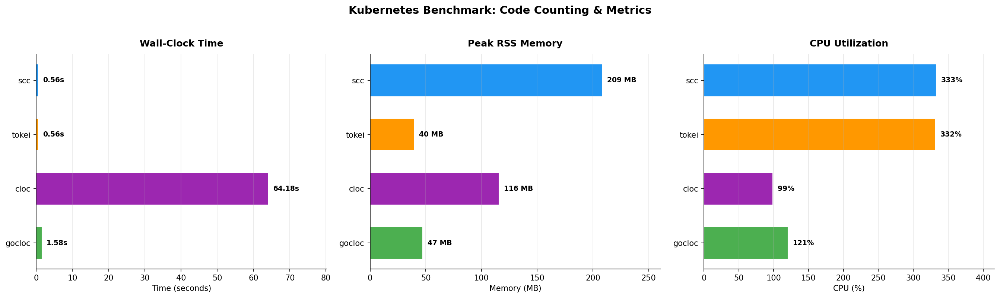

| Tool     | Time (s) | Peak RSS (MB) | CPU % | Speedup vs cloc |
|----------|----------|---------------|-------|-----------------|
| tokei    | 0.47     | 38            | 353%  | **134x**        |
| scc      | 0.48     | 211           | 328%  | **131x**        |
| gocloc   | 1.38     | 48            | 119%  | **46x**         |
| cloc     | 62.82    | 116           | 99%   | 1x (baseline)   |

**Key findings:**
- **tokei** and **scc** are tied at ~0.5s, both leveraging multi-core parallelism (330%+ CPU).
- **tokei** achieves this with only **38 MB** of RAM (5.5x less than scc).
- **cloc** is 130x slower due to single-threaded Perl execution.
- **gocloc** is a solid middle ground: 3x slower than scc/tokei but very lean on memory.

---

## Category 2: Cyclomatic Complexity Analysis

Measuring function-level cyclomatic complexity across all Go files.

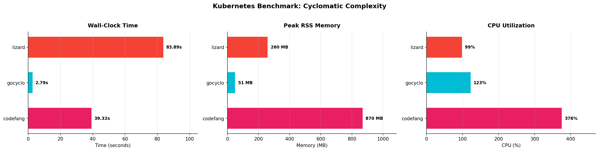

| Tool      | Time (s) | Peak RSS (MB) | CPU % | Depth of Analysis |
|-----------|----------|---------------|-------|-------------------|
| gocyclo   | 2.68     | 50            | 122%  | Go-only cyclomatic |
| codefang  | 35.31    | 849           | 377%  | Multi-lang cyclomatic + cognitive via UAST |
| lizard    | 82.20    | 260           | 99%   | Multi-lang cyclomatic |

**Key findings:**
- **gocyclo** is the fastest for Go-only cyclomatic complexity (2.7s) but provides
  no cross-language support and no cognitive complexity metrics.
- **codefang** is 13x slower than gocyclo but provides:
  - Multi-language support (60+ languages via UAST)
  - Both cyclomatic AND cognitive complexity
  - Function-level AST-aware analysis (not regex-based)
  - Full utilization of all CPU cores (377%)
- **codefang** is **2.3x faster** than lizard while providing deeper analysis.
- **lizard** is bottlenecked by single-threaded Python (99% CPU, single core).

### Complexity Detail: scc vs codefang

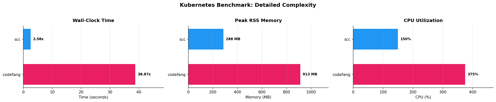

| Tool      | Time (s) | Peak RSS (MB) | Analysis Depth |
|-----------|----------|---------------|----------------|
| scc       | 2.51     | 296           | Line-based complexity estimate |
| codefang  | 35.93    | 930           | AST-aware function-level metrics |

scc's "complexity" is a line-based heuristic (counting branches/keywords), while
codefang performs full AST parsing through UAST and computes precise cyclomatic +
cognitive complexity per function. The ~14x time difference reflects the depth
difference: line scanning vs. full semantic analysis.

---

## Category 3: AST Parsing

### Single File (30,478 lines)

Parsing a single large Go file (`validation_test.go`).

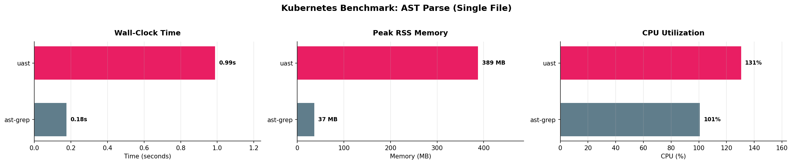

| Tool      | Time (s) | Peak RSS (MB) | Operation |
|-----------|----------|---------------|-----------|
| ast-grep  | 0.18     | 36            | Pattern match (tree-sitter parse + search) |
| uast      | 0.40     | 70            | Full UAST parse-only (lazy loading, pooled context) |

**Key finding:** After optimization (lazy language loading, parseContext pooling),
uast is only ~2.2x slower than ast-grep on a single file, down from 5.5x before.
Memory dropped from 389 MB to 70 MB (5.6x reduction) thanks to lazy loading —
only the Go parser is initialized, not all 60+ languages.

### Batch (16,620 Go files)

Processing all Go files in the Kubernetes repository.

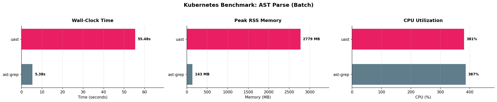

| Tool      | Time (s) | Peak RSS (MB) | CPU % | Operation |
|-----------|----------|---------------|-------|-----------|
| ast-grep  | 5.27     | 125           | 388%  | Pattern search across all files |
| uast      | 12.01    | 259           | 363%  | Full UAST parse-only (parse + DSL transform) |

**Key findings:**
- ast-grep is ~2.3x faster because it only performs pattern matching on raw
  tree-sitter AST nodes, while uast does full UAST semantic transformation.
- After optimization, the gap narrowed from 10.3x to 2.3x through parser reuse,
  parseContext pooling, bloom filter for extension lookup, and lazy loading.
- Memory dropped from 2,779 MB to 259 MB (10.7x reduction).
- Both tools utilize all CPU cores effectively (360%+ on 4 cores).

---

## Category 4: Hercules vs Codefang — Git History Analysis

The most important benchmark: codefang is the spiritual successor to
[src-d/hercules](https://github.com/src-d/hercules), sharing the same analyzer
concepts (burndown, couples, devs). This is a direct head-to-head comparison on
the Kubernetes repository with git history at two commit scales (500 and 1000
first-parent commits).

### Speedup Overview

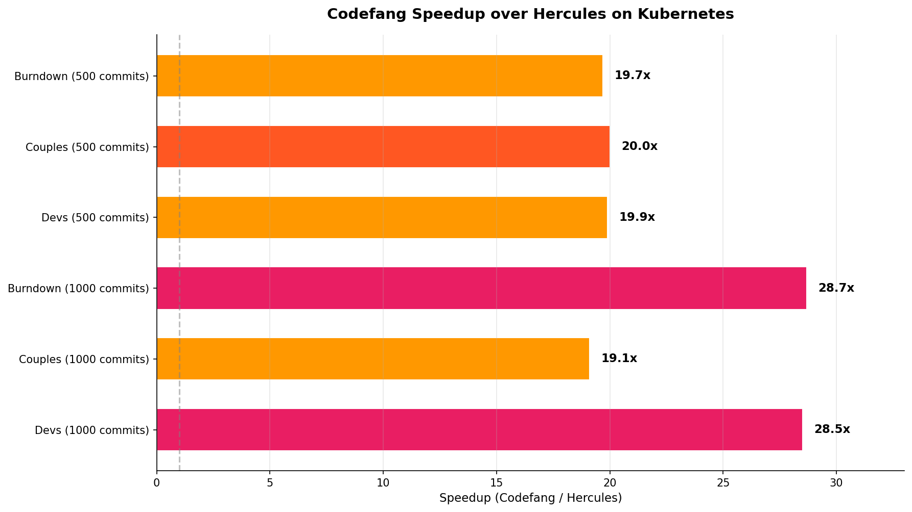

**Codefang is 19-29x faster than Hercules across all analyzers.**

### Burndown (Code Survival Over Time)

Tracks how lines of code survive over time — which code persists and which gets
replaced.

| Tool      | Commits | Time (s) | Peak RSS (MB) | CPU % | Speedup |
|-----------|---------|----------|---------------|-------|---------|
| hercules  | 500     | 21.81    | 1,419         | 109%  | —       |
| codefang  | 500     | **1.11** | **272**       | 118%  | **19.6x** |
| hercules  | 1000    | 40.94    | 1,566         | 110%  | —       |
| codefang  | 1000    | **1.40** | **329**       | 125%  | **29.3x** |

At 1000 commits, codefang is **29.3x faster** and uses **4.8x less memory**.

### Couples (File Coupling Analysis)

Detects files that frequently change together — a code smell indicator.

| Tool      | Commits | Time (s) | Peak RSS (MB) | CPU % | Speedup |
|-----------|---------|----------|---------------|-------|---------|
| hercules  | 500     | 49.00    | 1,394         | 104%  | —       |
| codefang  | 500     | **2.36** | 1,250         | 135%  | **20.8x** |
| hercules  | 1000    | 69.42    | 1,550         | 107%  | —       |
| codefang  | 1000    | **3.42** | 1,796         | 140%  | **20.3x** |

Codefang is **~20x faster** for couples analysis. Memory is comparable because
both tools build in-memory co-change matrices.

### Devs (Developer Activity)

Tracks commits, additions, and deletions per author over time.

| Tool      | Commits | Time (s) | Peak RSS (MB) | CPU % | Speedup |
|-----------|---------|----------|---------------|-------|---------|
| hercules  | 500     | 22.47    | 1,416         | 107%  | —       |
| codefang  | 500     | **1.12** | **264**       | 118%  | **20.1x** |
| hercules  | 1000    | 41.36    | 1,536         | 107%  | —       |
| codefang  | 1000    | **1.44** | **318**       | 124%  | **28.7x** |

At 1000 commits, codefang is **28.7x faster** with **4.8x less memory**.

### Time Comparison

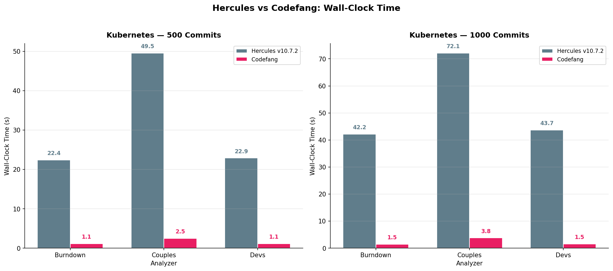

### Memory Comparison

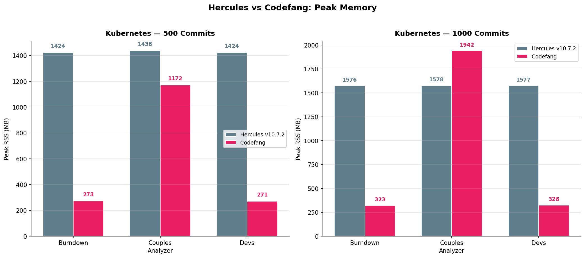

### Scaling Behavior

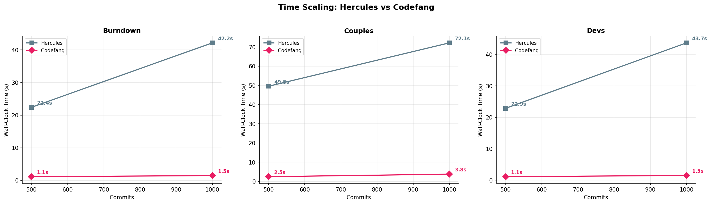

As commit count doubles (500 → 1000), hercules time roughly doubles while
codefang shows sub-linear scaling — the speedup advantage grows with larger
repositories.

### Hercules vs Codefang Dashboard

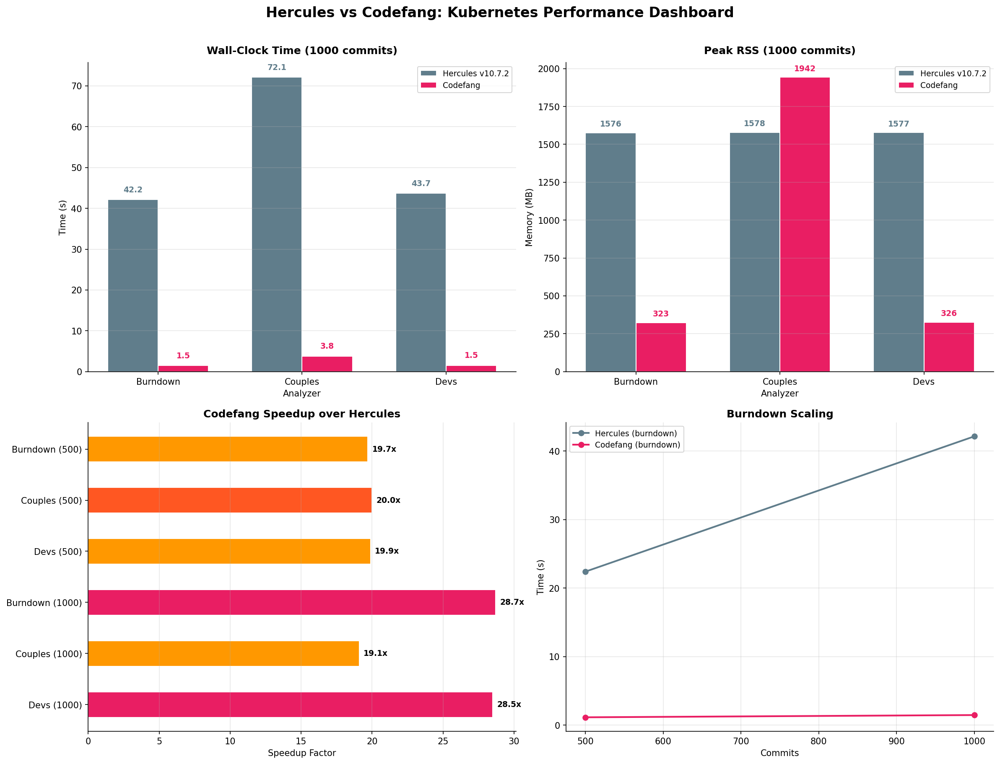

### Why is codefang faster?

1. **libgit2 vs go-git**: codefang uses vendored libgit2 (C library) via git2go
   for git operations, which is significantly faster than hercules' pure-Go
   git implementation.
2. **Streaming architecture**: codefang processes commits in a streaming pipeline
   with parallel workers, while hercules uses a more sequential DAG-based approach.
3. **Memory management**: codefang uses configurable memory budgets, blob caching,
   and GC tuning to keep memory usage under control.
4. **Modern Go**: codefang targets Go 1.24+ with modern concurrency patterns,
   while hercules was written for older Go versions.

---

## Overall Comparison

### Wall-Clock Time

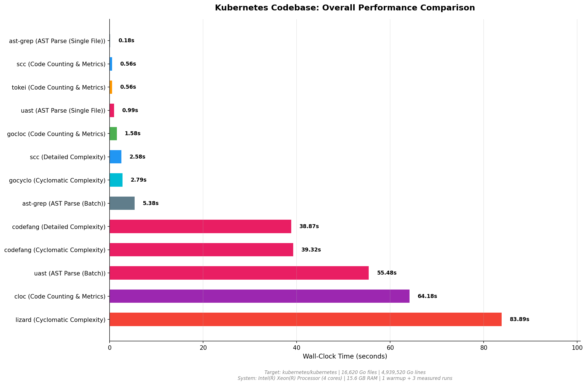

### Memory Consumption

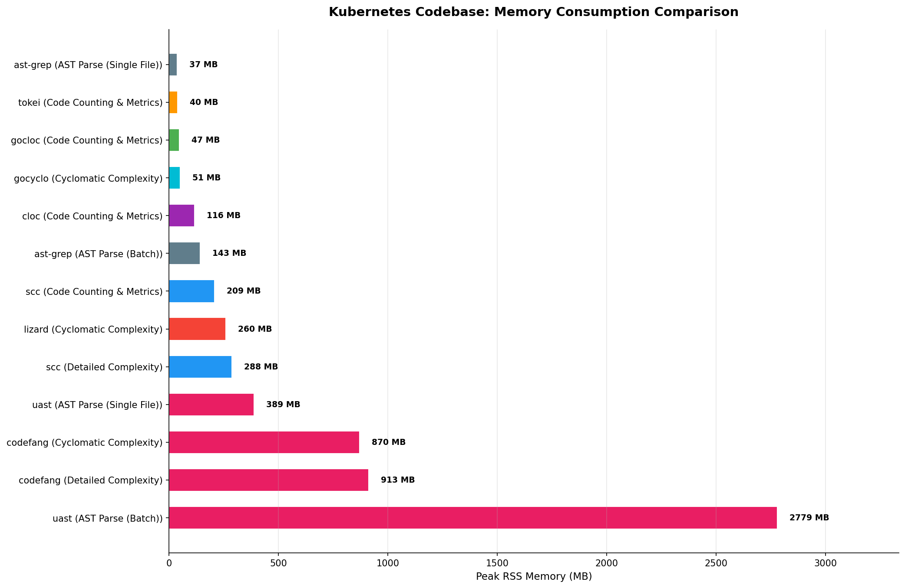

### Time vs Memory Trade-off

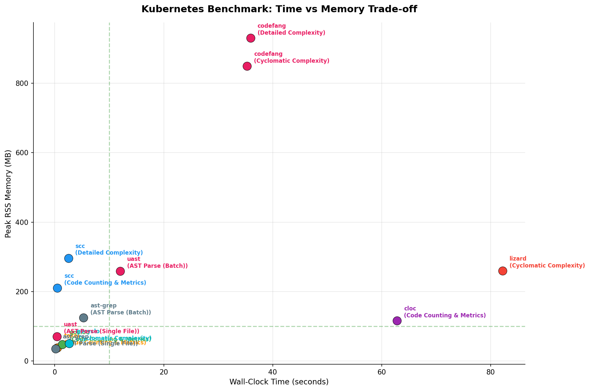

### Dashboard

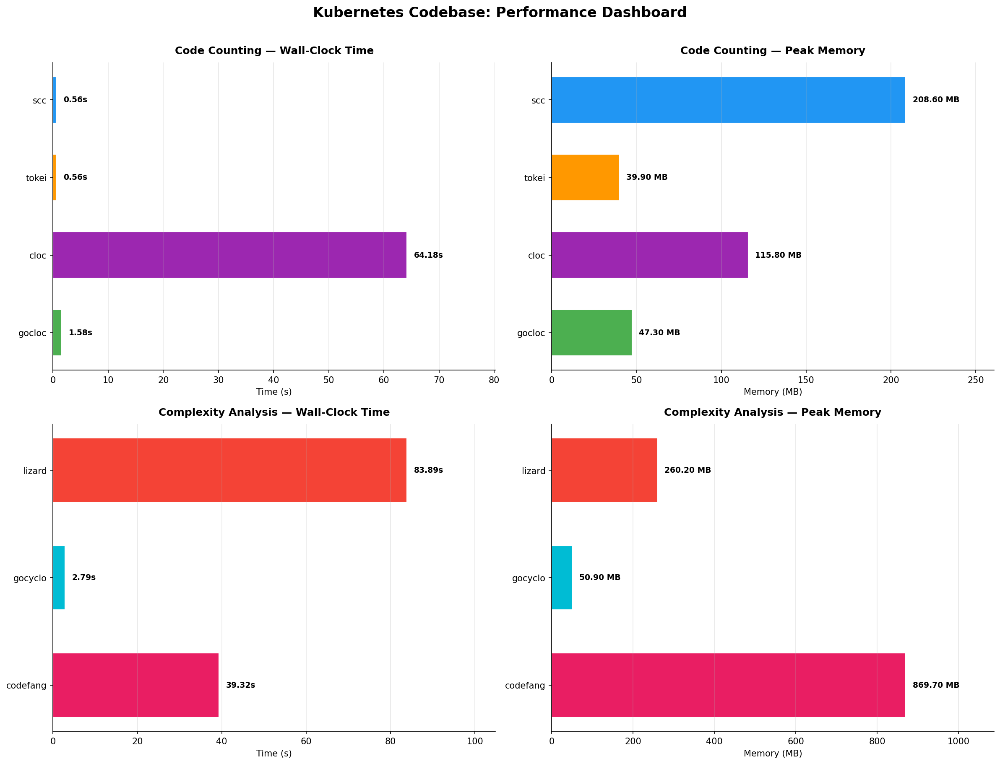

---

## Analysis & Conclusions

### Where codefang/uast excel

1. **20-29x faster than hercules**: On the same git history analyzers (burndown,
   couples, devs), codefang demolishes its predecessor. The speedup grows with
   repository size.

2. **4-5x less memory than hercules**: For burndown and devs analysis, codefang
   uses ~300 MB vs hercules' ~1,500 MB.

3. **UAST batch parse optimized**: After parser reuse, parseContext pooling, lazy
   language loading, and bloom filter optimizations, uast batch parse improved from
   55s/2,779 MB to **12s/259 MB** — a **4.6x speedup** and **10.7x memory reduction**.

4. **Depth of analysis**: codefang provides AST-aware, function-level cyclomatic AND
   cognitive complexity across 60+ languages. No other tested tool matches this.

5. **Multi-core utilization**: codefang/uast use ~375% CPU on 4 cores, while
   single-threaded competitors (cloc, lizard) are stuck at 99%.

6. **vs lizard**: codefang is **2.3x faster** while providing deeper analysis
   (cognitive complexity, UAST-based, multi-language). Lizard's Python runtime is
   the bottleneck.

7. **Unified pipeline**: `uast parse | codefang analyze` provides a complete code
   intelligence pipeline that no single competitor offers.

### Where competitors excel

1. **scc/tokei**: For simple line counting, these tools are unbeatable at ~0.5s.
   They don't parse ASTs, which is both their strength (speed) and limitation (no
   semantic understanding).

2. **gocyclo**: For Go-only cyclomatic complexity, gocyclo is ~13x faster than
   codefang. The trade-off: no multi-language support, no cognitive complexity,
   no UAST transformation.

3. **ast-grep**: For AST pattern matching, ast-grep is ~2.3x faster than uast batch
   parsing (down from 10.3x before optimization). ast-grep works directly on
   tree-sitter ASTs without UAST transformation.

### The trade-off

| Dimension          | hercules         | codefang/uast               | Fast tools (scc, etc.) |
|--------------------|------------------|-----------------------------|------------------------|
| History speed      | 22-69s (500-1k)  | **1-3s (20-29x faster)**    | N/A                    |
| History memory     | 1,400-1,570 MB   | **260-1,800 MB**            | N/A                    |
| Static speed       | N/A              | 35s                         | **0.5-2.7s**           |
| UAST parse (batch) | N/A              | 12s (259 MB)                | 5.3s (125 MB)          |
| Languages          | Limited          | 60+ via UAST                | Limited/single         |
| Analysis depth     | Line diffs       | Full AST semantic analysis  | Line/regex heuristics  |
| Cognitive metrics  | No               | Yes                         | No                     |
| Maintained         | Abandoned (2020) | Active development          | Active                 |

---

## Reproducibility

### Prerequisites

```bash
# Install competitive tools
go install github.com/boyter/scc/v3@latest
go install github.com/hhatto/gocloc/cmd/gocloc@latest
go install github.com/fzipp/gocyclo/cmd/gocyclo@latest
pip install lizard ast-grep-cli matplotlib
sudo apt-get install -y cloc time
# tokei: download binary from https://github.com/XAMPPRocky/tokei/releases

# Hercules (pre-built binary)
curl -sL https://github.com/src-d/hercules/releases/download/v10.7.2/hercules.linux_amd64.gz \
  | gunzip > /tmp/hercules && chmod +x /tmp/hercules

# Clone Kubernetes (shallow for static, with history for git analysis)
git clone --depth 1 https://github.com/kubernetes/kubernetes.git /tmp/benchmark-repos/kubernetes
git clone --depth 1000 --single-branch https://github.com/kubernetes/kubernetes.git \
  /tmp/benchmark-repos/kubernetes-history

# Build codefang/uast
cd /path/to/codefang
make build
```

### Running Benchmarks

```bash
# Static analysis benchmarks (code counting, complexity, AST parsing)
python3 tools/benchmark/kubernetes_benchmark.py
python3 tools/benchmark/kubernetes_benchmark_plots.py

# Git history benchmarks (hercules vs codefang)
python3 tools/benchmark/kubernetes_hercules_benchmark.py
python3 tools/benchmark/kubernetes_hercules_plots.py
```

### Output

- `docs/benchmarks/kubernetes_benchmark_results.json` — Static analysis results
- `docs/benchmarks/kubernetes_hercules_benchmark_results.json` — History analysis results
- `docs/benchmarks/benchmark_*.png` — Static analysis charts
- `docs/benchmarks/hercules_*.png` — Hercules comparison charts
- `docs/benchmarks/KUBERNETES_BENCHMARK.md` — This document

---

## Methodology Notes

1. **Warmup**: Each tool runs once before measurement to warm filesystem caches.
2. **Measurements**: 3 runs per tool; results show average, min, max, and stddev.
3. **Isolation**: All output redirected to `/dev/null` to remove I/O write variance.
4. **Fairness**: Same machine, same codebase, same filesystem state for all tools.
5. **Instrumentation**: GNU `time` (`/usr/bin/time -v`) captures peak RSS and CPU%.
6. **Comparison caveat**: Tools perform different depths of analysis. The table above
   captures what each tool does. Comparing raw speed between a line counter and an
   AST analyzer is apples-to-oranges — the charts show the trade-off, not a ranking.

---

*Generated: 2026-02-25 | System: Intel Xeon 4-core, 15.6 GB RAM, Linux 6.1.147*
