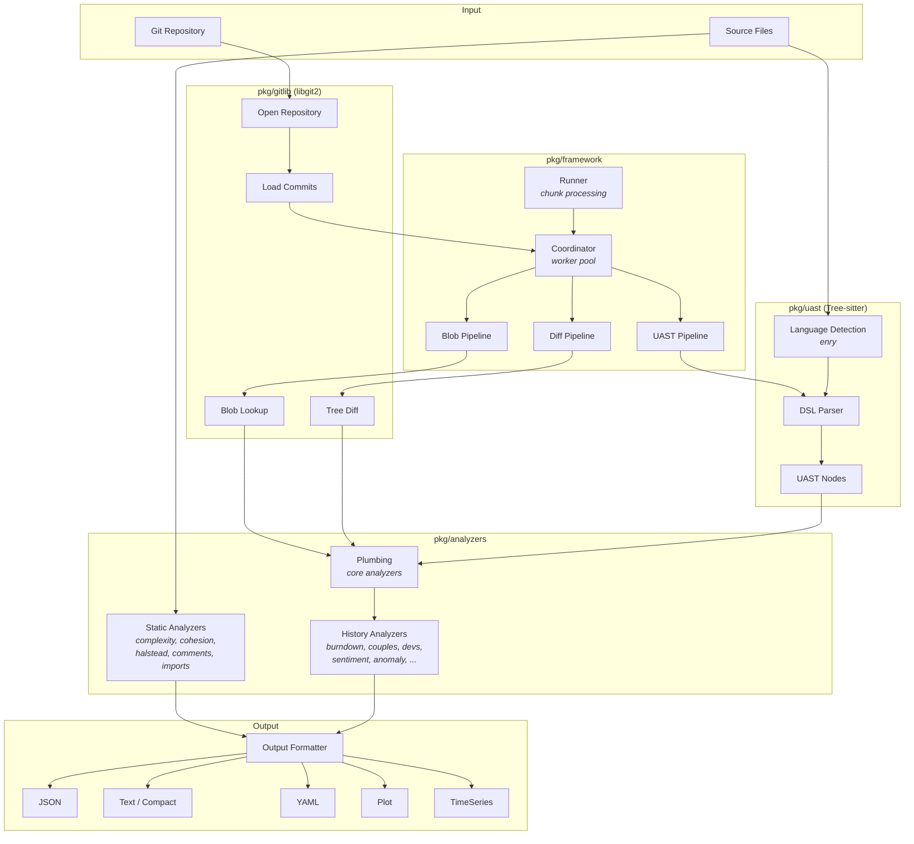
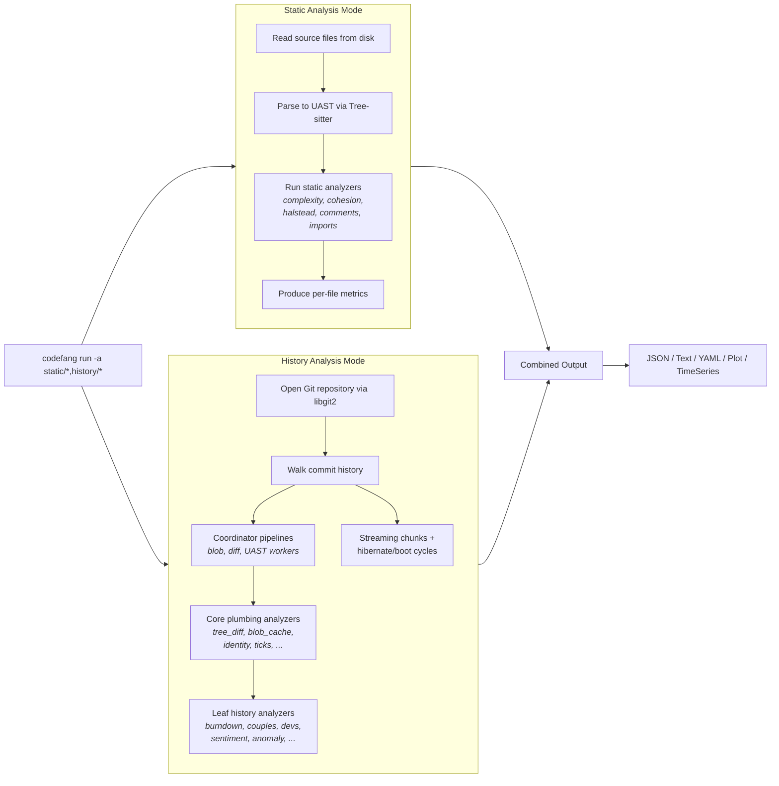

# Architecture Overview

Codefang follows the **Unix philosophy**: small, focused tools joined by pipes.
The project ships two binaries that can be used independently or composed
together in pipelines, CI systems, and AI agent workflows.

## Two Binaries

| Binary | Purpose | Entry point |
|--------|---------|-------------|
| `uast` | Parse source code into Universal Abstract Syntax Trees | `cmd/uast/` |
| `codefang` | Run static and history analyzers on code and repositories | `cmd/codefang/` |

Both CLIs are built with [Cobra](https://github.com/spf13/cobra) and share
the same `pkg/` libraries.

```bash
# Parse a Go file into UAST JSON
uast parse main.go

# Run static complexity analysis
codefang run -a static/complexity .

# Run git history analysis
codefang run -a history/burndown,history/devs .

# Compose: parse, then analyze
uast parse main.go | codefang run -a static/* --format json
```

---

## Package Structure

### CLI Layer

| Package | Description |
|---------|-------------|
| `cmd/codefang/` | CLI entry point for the analyzer. Cobra commands for `run`, `mcp`, etc. |
| `cmd/uast/` | CLI entry point for the UAST parser. Commands: `parse`, `query`, `diff`, `explore`, `server`. |

### Core Libraries

| Package | Description |
|---------|-------------|
| `pkg/uast/` | UAST parser engine. Tree-sitter integration, DSL engine, language mappings, pre-compiled matchers. |
| `pkg/analyzers/` | All analysis logic -- static analyzers and history analyzers. |
| `pkg/framework/` | Pipeline orchestration: runner, coordinator, streaming, blob/diff/UAST pipelines, profiling, watchdog. |
| `pkg/gitlib/` | Git operations via libgit2 (git2go): repository, commit, tree, changes, worker pool, batch processing. |
| `pkg/config/` | Configuration system: types with mapstructure tags, Viper-based loader, compiled defaults, validation. |
| `pkg/mcp/` | Model Context Protocol server: tools for `codefang_analyze`, `uast_parse`, `codefang_history`. |
| `pkg/observability/` | OpenTelemetry integration: tracing, RED metrics, structured logging, HTTP middleware, attribute filter. |
| `pkg/streaming/` | Streaming pipeline planner: chunk sizing, memory budgets, double-buffered pipelining. |
| `pkg/cache/` | Generic LRU cache used by blob and diff caches. |
| `pkg/checkpoint/` | Checkpoint manager for crash recovery across streaming chunks. |
| `pkg/budget/` | Memory budget solver for auto-tuning pipeline parameters. |

### Analyzers (`pkg/analyzers/`)

#### Shared Components (`plumbing/`)

The plumbing package provides the shared pipeline components that all history
analyzers depend on. These run as "core" analyzers in the pipeline before any
leaf analyzers consume their output.

| Component | File | Purpose |
|-----------|------|---------|
| `TreeDiffAnalyzer` | `tree_diff.go` | Computes per-commit tree diffs via libgit2 |
| `BlobCacheAnalyzer` | `blob_cache.go` | Caches blob content for efficient re-reads |
| `FileDiffAnalyzer` | `file_diff.go` | Computes file-level diffs from blobs |
| `IdentityDetector` | `identity.go` | Maps commit authors to canonical identities |
| `LanguagesDetectionAnalyzer` | `languages.go` | Detects file languages via enry |
| `TicksSinceStart` | `ticks.go` | Assigns tick indices to commits for time-series |
| `LinesStatsCalculator` | `line_stats.go` | Computes per-commit line addition/deletion stats |
| `UASTChangesAnalyzer` | `uast.go` | Parses UAST for changed files |

#### Static Analyzers (`analyze/`)

| Analyzer | ID | Description |
|----------|----|-------------|
| Complexity | `static/complexity` | Cyclomatic complexity per function |
| Comments | `static/comments` | Comment density and documentation coverage |
| Halstead | `static/halstead` | Halstead software science metrics |
| Cohesion | `static/cohesion` | Class/module cohesion metrics |
| Imports | `static/imports` | Import graph and dependency analysis |

The `analyze/` package also contains the static analysis service, analyzer
registry, factory, output formatting (JSON, text, compact, YAML, plot, binary,
timeseries), and cross-format conversion logic.

#### History Analyzers

| Analyzer | ID | Description |
|----------|----|-------------|
| Burndown | `history/burndown` | Code age and survival analysis |
| Couples | `history/couples` | File co-change coupling detection |
| Devs | `history/devs` | Developer contribution statistics |
| File History | `history/file-history` | Per-file change timeline |
| Sentiment | `history/sentiment` | Code comment sentiment over time |
| Shotness | `history/shotness` | Function-level change frequency |
| Typos | `history/typos` | Identifier typo detection in diffs |
| Imports | `history/imports` | Import evolution over time |
| Anomaly | `history/anomaly` | Temporal anomaly detection via Z-score |
| Quality | `history/quality` | UAST-based quality metrics over time |

---

## Data Flow

The following diagram shows how data flows through the system during a
combined static + history analysis run.



---

## Two Analysis Modes

Codefang operates in two distinct modes that can run independently or be
combined in a single `codefang run` invocation.



### Static Mode

1. Reads source files from the filesystem.
2. Parses each file into a UAST using Tree-sitter with DSL-based mappings.
3. Runs selected static analyzers (complexity, cohesion, halstead, comments, imports).
4. Produces per-file and aggregate metrics.

Static analysis is fast, parallelized across files, and requires no Git history.

### History Mode

1. Opens the Git repository via libgit2 (supports both normal and bare repos).
2. Loads the commit history (optionally filtered by `--limit`, `--since`, `--first-parent`).
3. The **Coordinator** orchestrates a worker pool with three pipeline stages: blob loading, diff computation, and UAST parsing.
4. **Core plumbing analyzers** (tree diff, blob cache, identity detection, tick assignment, line stats, language detection, UAST changes) process each commit first.
5. **Leaf history analyzers** consume the plumbing output and accumulate their state.
6. For large repositories, the **streaming pipeline** splits commits into memory-bounded chunks with hibernate/boot cycles and optional double-buffered pipelining.
7. **Checkpointing** after each chunk enables crash recovery.

### Combined Mode

When both static and history analyzers are selected, Codefang runs both phases
sequentially, encodes each phase to an internal binary format, then decodes and
merges the results into a single output document in the requested format.

---

## Pipeline Architecture

The history analysis pipeline is built around a **Runner** that coordinates
the full lifecycle:

```
Initialize --> ProcessChunk (x N) --> Finalize
```

Each `ProcessChunk` call:

1. Feeds commits to the **Coordinator** worker pool.
2. The Coordinator dispatches work across three parallel pipeline stages (blob, diff, UAST).
3. Collected `CommitData` is fed sequentially to each analyzer's `Consume` method.
4. Between chunks, hibernatable analyzers serialize their state to compact form and reboot.

The **Runner** supports two execution strategies:

- **Single-pass**: All commits in one chunk (small repos or unlimited memory).
- **Streaming**: Memory-bounded chunks with hibernate/boot cycles, planned by the `streaming.Planner`. See [Streaming Pipeline](streaming-pipeline.md) for details.

---

## Configuration Layers

Configuration follows a clear priority chain:

```
CLI flags  >  Environment variables  >  .codefang.yaml  >  Compiled defaults
```

The `pkg/config/` package uses [Viper](https://github.com/spf13/viper) for
loading and merging. Environment variables use the `CODEFANG_` prefix with
underscore-separated nesting (e.g., `CODEFANG_PIPELINE_WORKERS=8`).

See the [Configuration reference](../guide/configuration.md) for the full
config file structure and validation rules.

---

## Observability

Every layer of the pipeline is instrumented with OpenTelemetry:

- **Tracing**: Hierarchical spans from `codefang.run` through coordinator pipeline, chunk processing, individual analyzers, git operations, and UAST parsing.
- **Metrics**: RED (Rate, Errors, Duration) metrics plus analysis-specific counters (commits, chunks, cache hit rates).
- **Logging**: Structured `slog` logging with automatic trace context injection.

See [Observability](../operations/observability.md) for the full instrumentation guide.
