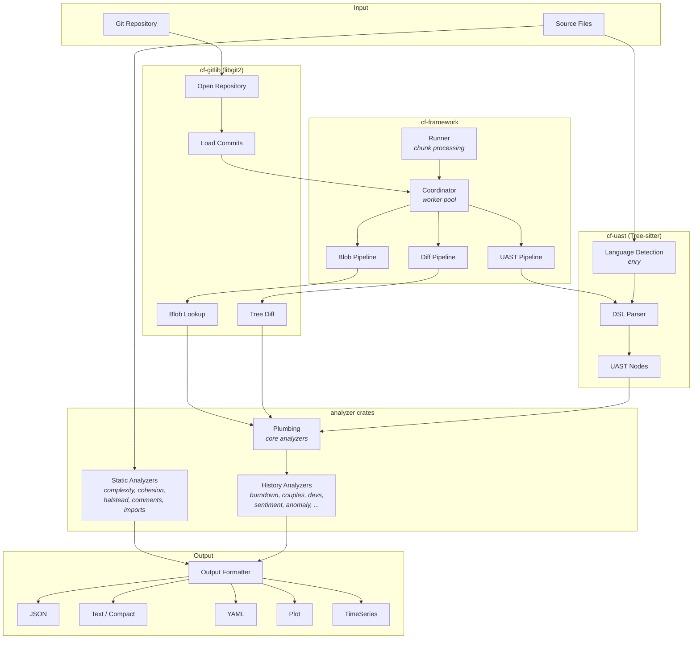
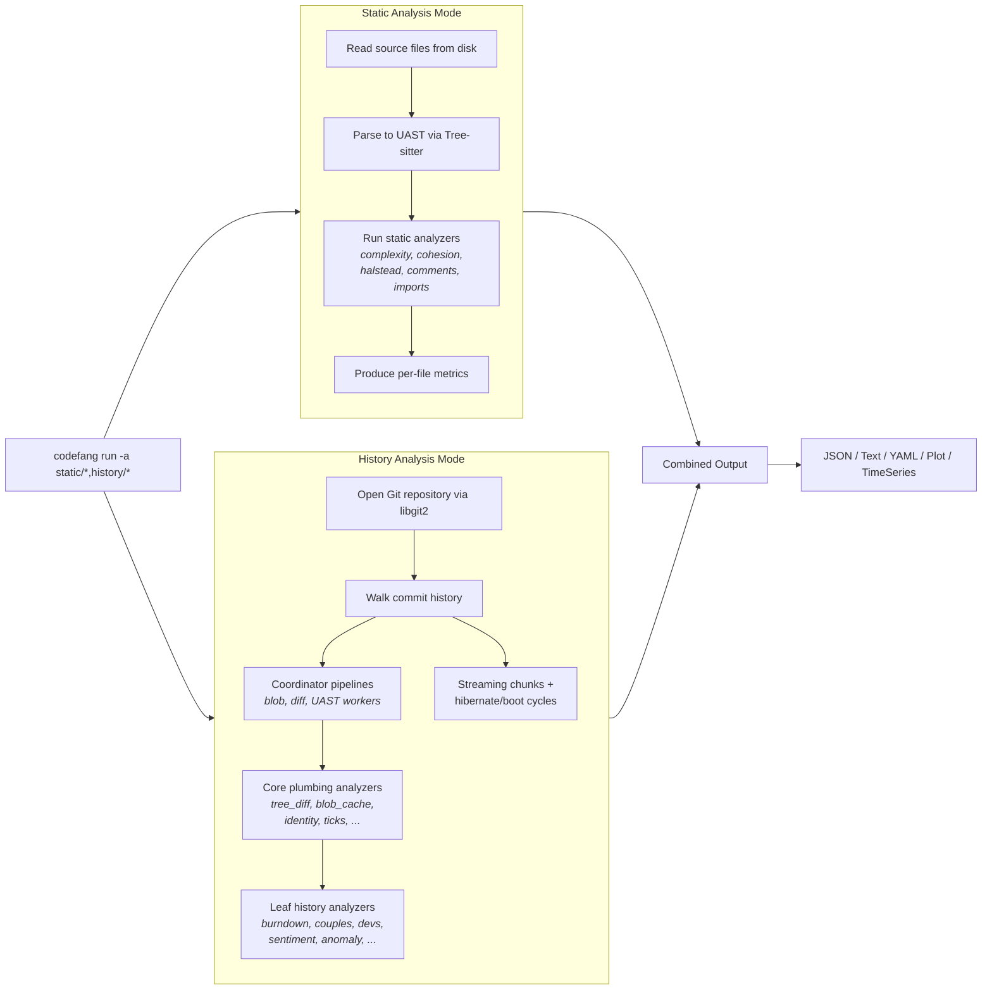

# Architecture overview

Codefang follows the **Unix philosophy**: small, focused tools joined by pipes.
The project ships two binaries that can be used independently or composed
together in pipelines, CI systems, and AI agent workflows.

## Two binaries

| Binary | Purpose | Entry point |
|--------|---------|-------------|
| `uast` | Parse source code into Universal Abstract Syntax Trees | `bins/uast/` |
| `codefang` | Run static and history analyzers on code and repositories | `bins/codefang/` |

Both CLIs are thin entrypoints over the shared workspace crates: the `cf-uast*`
crates for parsing and `cf-commands` plus the per-analyzer crates for analysis.

```bash
# Parse a source file into UAST JSON
uast parse main.rs

# Run static complexity analysis
codefang run -a static/complexity --head .

# Run git history analysis
codefang run -a history/burndown,history/devs --limit 50 .
```

---

## Package structure

### CLI layer

| Crate | Description |
|-------|-------------|
| `bins/codefang` | CLI entry point for the analyzer. Subcommands `run`, `render`, `version`, `completion`. Delegates to `cf-commands`. |
| `bins/uast` | CLI entry point for the UAST parser. Subcommands `parse`, `query`, `diff`, `explore`, `analyze`, `validate`, `mapping`, `lsp`, `server`. |

### Core libraries (workspace crates)

The Rust port is a workspace of small, single-responsibility crates (`cf-*`).
The most important ones:

| Crate | Description |
|-------|-------------|
| `cf-uast` | UAST parser engine: Tree-sitter integration, DSL engine, language mappings, pre-compiled matchers. |
| `cf-uast-node`, `cf-uast-spec` | UAST node model and the schema it conforms to. |
| `cf-commands` | The `codefang` command bodies (`run`, `render`) and analyzer wiring. |
| `cf-framework`, `cf-pipeline`, `cf-streaming` | Pipeline orchestration: runner, coordinator, blob/diff/UAST stages, memory-bounded streaming. |
| `cf-gitlib` | Git operations via the `git2` crate (vendored libgit2): repository, commit, tree, changes, batch blob/diff worker. |
| `cf-alg`, `cf-alg-stats`, `cf-alg-mapx`, `cf-alg-lru`, … | Generic algorithms, statistics, map/slice helpers, and supporting data structures used across analyzers. |
| `cf-gojson`, `cf-goyaml`, `cf-gosort` | Go-byte-compatible serialization encoders — the only path report output may use, so output stays byte-identical to the frozen oracle. |
| `cf-safeconv` | Safe numeric conversions (clamp / checked / extract) used across the workspace. |
| `cf-persist`, `cf-checkpoint`, `cf-storage` | Codec-based persistence, checkpointing for crash recovery, atomic file writes. |
| `cf-config` | Configuration system: typed config, loader, compiled defaults, validation. |
| `cf-mcp` | Model Context Protocol server exposing analysis as agent tools. |
| `cf-observability` | OpenTelemetry integration: tracing, RED metrics, structured logging. |
| `cf-budget`, `cf-cache`, `cf-meminfo` | Memory-budget solver, blob/hash caches, memory introspection for auto-tuning. |
| Analyzer crates (`cf-complexity`, `cf-cohesion`, `cf-halstead`, `cf-comments`, `cf-imports`, `cf-clones`, `cf-composition`, `cf-burndown-core`, `cf-couples`, `cf-devs`, `cf-file-history`, `cf-sentiment`, `cf-shotness`, `cf-typos`, `cf-anomaly`, `cf-quality`) | One crate per analyzer's logic. |

### Analyzers

#### Shared components (`cf-analyzers-plumbing`)

The plumbing crate provides the shared pipeline components that all history
analyzers depend on. These run as "core" analyzers in the pipeline before any
leaf analyzers consume their output.

| Component | Purpose |
|-----------|---------|
| Tree-diff analyzer | Computes per-commit tree diffs via libgit2 |
| Blob-cache analyzer | Caches blob content for efficient re-reads |
| File-diff analyzer | Computes file-level diffs from blobs |
| Identity detector | Maps commit authors to canonical identities |
| Language detection | Detects file languages |
| Ticks-since-start | Assigns tick indices to commits for time-series |
| Line-stats calculator | Computes per-commit line addition/deletion stats |
| UAST-changes analyzer | Parses UAST for changed files |

#### Static analyzers

| Analyzer | ID | Description |
|----------|----|-------------|
| Complexity | `static/complexity` | Cyclomatic complexity per function |
| Comments | `static/comments` | Comment density and documentation coverage |
| Halstead | `static/halstead` | Halstead software science metrics |
| Cohesion | `static/cohesion` | Class/module cohesion metrics |
| Imports | `static/imports` | Import graph and dependency analysis |

The analysis layer also contains the static analysis service, analyzer
registry, output formatting (JSON, text, compact, YAML, plot, binary,
timeseries), and cross-format conversion logic.

#### History analyzers

| Analyzer | ID | Description |
|----------|----|-------------|
| Burndown | `history/burndown` | Code age and survival analysis |
| Couples | `history/couples` | File co-change coupling detection |
| Devs | `history/devs` | Developer contribution statistics |
| File History | `history/file-history` | Per-file change timeline |
| Sentiment | `history/sentiment` | Code comment sentiment over time |
| Shotness | `history/shotness` | Function-level change frequency |
| Typos | `history/typos` | Identifier typo detection in diffs |
| Imports | `history/imports` | Import evolution over time |
| Anomaly | `history/anomaly` | Temporal anomaly detection via Z-score |
| Quality | `history/quality` | UAST-based quality metrics over time |

---

## Data flow

The following diagram shows how data flows through the system during a
combined static + history analysis run.


```mermaid
flowchart TD
    subgraph Input
        REPO[Git Repository]
        SRC[Source Files]
    end

    subgraph gitlib["cf-gitlib (libgit2)"]
        OPEN[Open Repository]
        COMMITS[Load Commits]
        TREEDIFF[Tree Diff]
        BLOBS[Blob Lookup]
    end

    subgraph uast_engine["cf-uast (Tree-sitter)"]
        DETECT[Language Detection<br/><em>enry</em>]
        PARSE[DSL Parser]
        NODES[UAST Nodes]
    end

    subgraph framework["cf-framework"]
        COORD[Coordinator<br/><em>worker pool</em>]
        BLOB_PIPE[Blob Pipeline]
        DIFF_PIPE[Diff Pipeline]
        UAST_PIPE[UAST Pipeline]
        RUNNER[Runner<br/><em>chunk processing</em>]
    end

    subgraph analyzers["analyzer crates"]
        PLUMB[Plumbing<br/><em>core analyzers</em>]
        STATIC[Static Analyzers<br/><em>complexity, cohesion,<br/>halstead, comments, imports</em>]
        HISTORY[History Analyzers<br/><em>burndown, couples, devs,<br/>sentiment, anomaly, ...</em>]
    end

    subgraph output["Output"]
        FORMAT[Output Formatter]
        JSON_OUT[JSON]
        TEXT_OUT[Text / Compact]
        YAML_OUT[YAML]
        PLOT_OUT[Plot]
        TS_OUT[TimeSeries]
    end

    REPO --> OPEN --> COMMITS
    COMMITS --> COORD
    COORD --> BLOB_PIPE --> BLOBS
    COORD --> DIFF_PIPE --> TREEDIFF
    COORD --> UAST_PIPE --> PARSE
    SRC --> DETECT --> PARSE --> NODES

    BLOBS --> PLUMB
    TREEDIFF --> PLUMB
    NODES --> PLUMB

    PLUMB --> HISTORY
    SRC --> STATIC

    RUNNER --> COORD

    STATIC --> FORMAT
    HISTORY --> FORMAT
    FORMAT --> JSON_OUT
    FORMAT --> TEXT_OUT
    FORMAT --> YAML_OUT
    FORMAT --> PLOT_OUT
    FORMAT --> TS_OUT
```

---

## Two analysis modes

Codefang operates in two distinct modes that can run independently or be
combined in a single `codefang run` invocation.


```mermaid
flowchart LR
    subgraph static_mode["Static Analysis Mode"]
        direction TB
        S1[Read source files from disk]
        S2[Parse to UAST via Tree-sitter]
        S3[Run static analyzers<br/><em>complexity, cohesion,<br/>halstead, comments, imports</em>]
        S4[Produce per-file metrics]
        S1 --> S2 --> S3 --> S4
    end

    subgraph history_mode["History Analysis Mode"]
        direction TB
        H1[Open Git repository via libgit2]
        H2[Walk commit history]
        H3[Coordinator pipelines<br/><em>blob, diff, UAST workers</em>]
        H4[Core plumbing analyzers<br/><em>tree_diff, blob_cache,<br/>identity, ticks, ...</em>]
        H5[Leaf history analyzers<br/><em>burndown, couples, devs,<br/>sentiment, anomaly, ...</em>]
        H6[Streaming chunks +<br/>hibernate/boot cycles]
        H1 --> H2 --> H3 --> H4 --> H5
        H2 --> H6
    end

    CMD["codefang run -a static/*,history/*"]
    CMD --> static_mode
    CMD --> history_mode

    static_mode --> MERGE[Combined Output]
    history_mode --> MERGE
    MERGE --> OUT["JSON / Text / YAML / Plot / TimeSeries"]
```

### Static mode

1. Reads source files from the filesystem.
2. Parses each file into a UAST using Tree-sitter with DSL-based mappings.
3. Runs selected static analyzers (complexity, cohesion, halstead, comments, imports).
4. Produces per-file and aggregate metrics.

Static analysis is fast, parallelized across files, and requires no Git history.

### History mode

1. Opens the Git repository via libgit2 through the `git2` crate (supports both normal and bare repos).
2. Loads the commit history (optionally filtered by `--limit`, `--since`, `--first-parent`).
3. The **Coordinator** orchestrates a worker pool with three pipeline stages: blob loading, diff computation, and UAST parsing.
4. **Core plumbing analyzers** (tree diff, blob cache, identity detection, tick assignment, line stats, language detection, UAST changes) process each commit first.
5. **Leaf history analyzers** consume the plumbing output and accumulate their state using the generic aggregator framework or custom memory-efficient data structures.
6. For large repositories, the **streaming pipeline** splits commits into memory-bounded chunks with hibernate/boot cycles and optional double-buffered pipelining. The `BaseHistoryAnalyzer` manages state serialization transparently.
7. **Checkpointing** after each chunk enables crash recovery.

### Combined mode

When both static and history analyzers are selected, Codefang runs both phases
sequentially, encodes each phase to an internal binary format, then decodes and
merges the results into a single output document in the requested format.

---

## Pipeline architecture

The history analysis pipeline is built around a **Runner** that coordinates
the full lifecycle:

```text
Initialize --> ProcessChunk (x N) --> FinalizeWithAggregators
```

Each `ProcessChunk` call:

1. Feeds commits to the **Coordinator** worker pool.
2. The Coordinator dispatches work across three parallel pipeline stages (blob, diff, UAST).
3. Collected `CommitData` is fed sequentially to each analyzer's `Consume` method.
4. Between chunks, hibernatable analyzers serialize their state to compact form and reboot.

The **Runner** supports two execution strategies:

- **Single-pass**: All commits in one chunk (small repos or unlimited memory).
- **Streaming**: Memory-bounded chunks with hibernate/boot cycles, planned by the `streaming.Planner`. See [Streaming Pipeline](streaming-pipeline.md) for details.

---

## Configuration layers

Configuration follows a clear priority chain:

```text
CLI flags  >  Environment variables  >  .codefang.yaml  >  Compiled defaults
```

The `cf-config` crate handles loading and merging. Environment variables use the `CODEFANG_` prefix with
underscore-separated nesting (e.g., `CODEFANG_PIPELINE_WORKERS=8`).

See the [Configuration reference](../guide/configuration.md) for the full
config file structure and validation rules.

---

## Observability

Every layer of the pipeline is instrumented with OpenTelemetry:

- **Tracing**: Hierarchical spans from `codefang.run` through coordinator pipeline, chunk processing, individual analyzers, git operations, and UAST parsing.
- **Metrics**: RED (Rate, Errors, Duration) metrics plus analysis-specific counters (commits, chunks, cache hit rates).
- **Logging**: Structured `slog` logging with automatic trace context injection.

See [Observability](../operations/observability.md) for the full instrumentation guide.
