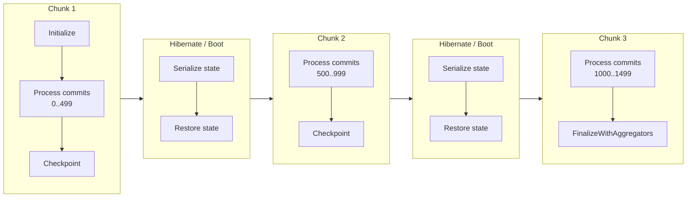
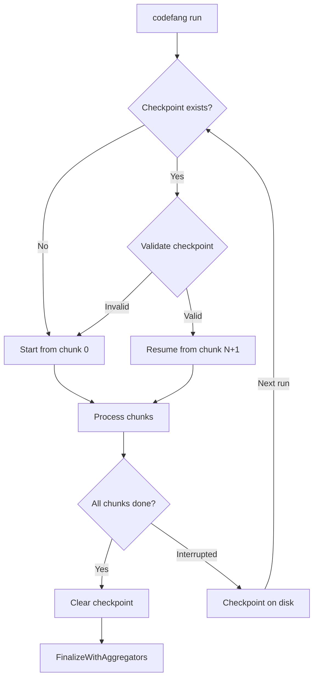

# Streaming Pipeline

Large Git repositories (tens or hundreds of thousands of commits) can easily
exhaust available memory if all analyzer state is accumulated in a single pass.
The streaming pipeline solves this by splitting commit history into
memory-bounded **chunks**, processing each chunk independently with
**hibernate/boot cycles** between them.

---

## The Problem

History analyzers accumulate state as they process commits. For example:

- **Burndown** tracks per-line ownership matrices that grow with repository size.
- **Couples** builds file co-change adjacency matrices.
- **Devs** accumulates per-developer statistics across languages.

For a 100k-commit repository, a naive single-pass approach may require 10+ GiB
of memory. Many CI environments and containers are limited to 2-8 GiB.

---

## The Solution: Chunk-Based Processing

The streaming pipeline:

1. **Plans** chunk boundaries based on memory budget and per-analyzer growth rates.
2. **Processes** each chunk by feeding commits to analyzers.
3. **Hibernates** analyzers between chunks (serialize state to compact form).
4. **Boots** analyzers for the next chunk (restore from compact state).
5. **Checkpoints** after each chunk for crash recovery.



---

## The Planner

The `streaming.Planner` calculates optimal chunk boundaries. It lives in
`pkg/streaming/planner.go`.

### Parameters

| Parameter | Value | Description |
|-----------|-------|-------------|
| `MinChunkSize` | 50 | Minimum commits per chunk to amortize hibernation cost |
| `MaxChunkSize` | 3,000 | Safety cap on commits per chunk |
| `BaseOverhead` | 400 MiB | Fixed memory for Go runtime + libgit2 + caches |
| `DefaultStateGrowthPerCommit` | 500 KiB | Conservative fallback per-commit growth rate (= `DefaultWorkingStateSize` + `DefaultAvgTCSize`) |
| `DefaultWorkingStateSize` | 400 KiB | Fallback per-commit working state estimate |
| `DefaultAvgTCSize` | 100 KiB | Fallback per-commit TC payload estimate |
| `SafetyMarginPercent` | 50% | Added to growth rate for transient allocations |
| `UsablePercent` | 95% | Budget fraction available after GC slack |
| `WorkStatePercent` | 60% | Fraction of remaining budget for analyzer working state |
| `AggStatePercent` | 30% | Fraction of remaining budget for aggregator spill budget |
| `ChunkMemPercent` | 10% | Fraction of remaining budget for in-flight data |

### Budget Decomposition: P + W + A + S

The scheduler decomposes the memory budget into four explicit regions:

```
B = P + W + A + S

usable    = budget * 0.95              (S = 5% slack for GC headroom)
remaining = usable - pipelineOverhead  (P = pipeline overhead)
workState = remaining * 0.60           (W = analyzer working state)
aggState  = remaining * 0.30           (A = aggregator state / spill budget)
chunkMem  = remaining * 0.10           (reserved for in-flight CommitData + TCs)
```

The `ComputeSchedule()` function in `pkg/streaming/planner.go` performs this
decomposition and returns a `Schedule` containing chunk boundaries, chunk size,
buffering factor, and the aggregator spill budget.

### Chunk Size Calculation

The planner determines chunk size from the **working state** portion of the budget:

```
growth     = working_state_per_commit * 1.5  (safety margin)
chunk_size = clamp(workState / growth, MinChunkSize, MaxChunkSize)
```

Where:

- **`workState`** is 60% of the remaining budget after pipeline overhead and slack.
- **`working_state_per_commit`** is the sum of all selected leaf analyzers' declared `WorkingStateSize()` values. Each leaf analyzer declares `WorkingStateSize()` (analyzer-internal data structures) and `AvgTCSize()` (per-commit TC payload). Only `WorkingStateSize()` drives chunk sizing; `AvgTCSize()` is used separately for aggregator budget estimation.

### Memory Sizing Methods

Each `HistoryAnalyzer` declares two per-commit memory estimates:

```go
// WorkingStateSize returns estimated bytes of analyzer-internal
// working state accumulated per commit (maps, treaps, matrices).
WorkingStateSize() int64

// AvgTCSize returns estimated bytes of TC payload emitted per commit.
AvgTCSize() int64
```

The planner sums `WorkingStateSize() + AvgTCSize()` across all selected leaf
analyzers. Plumbing analyzers return 0 for both and are excluded from the sum.

### Example

For a 10,000-commit repo with 4 GiB budget, 400 MiB pipeline overhead, and
1.5 MiB/commit working state growth:

```
usable     = 4 GiB * 0.95          = 3,891 MiB
remaining  = 3,891 - 400           = 3,491 MiB
workState  = 3,491 * 0.60          = 2,095 MiB
aggState   = 3,491 * 0.30          = 1,047 MiB  (AggSpillBudget)
growth     = 1.5 MiB * 1.5         = 2.25 MiB/commit
chunk_size = 2,095 / 2.25          = 931 commits
chunks     = ceil(10,000 / 931)    = 11 chunks
```

---

## Buffered Chunk Pipelining

When the memory budget is sufficient and multiple chunks are needed, the
pipeline enables **buffered pipelining** to overlap the pipeline stage
of upcoming chunks with the analyzer consumption stage of the current chunk.
The scheduler determines the **buffering factor** (1, 2, or 3) based on
the memory budget.

### The Insight

Processing a chunk has two phases:

1. **Pipeline phase**: The Coordinator runs git operations (blob loading, tree
   diffs, UAST parsing) through its worker pool. This is I/O-bound.
2. **Consume phase**: Analyzers consume the collected `CommitData` and update
   their state. This is CPU/memory-bound.

These two phases use different resources and can overlap.

### Buffering Factor Selection

The `ComputeSchedule()` function iterates buffering factors from `MaxBuffering`
(default 3) down to 1, selecting the highest factor where `ChunkSize >=
MinChunkSize`. Only the working state region (60% of remaining budget) is
divided among buffering slots; the aggregator spill budget is unaffected.

```
for bf = maxBuffering; bf >= 1; bf-- {
    chunkSize = workState / (bf * effectiveGrowth)
    if chunkSize >= MinChunkSize {
        return bf, chunkSize
    }
}
```

| Budget | Typical Factor | Behavior |
|--------|----------------|----------|
| 8 GiB | 2-3 | Double or triple buffering |
| 4 GiB | 2-3 | Double or triple buffering |
| 2 GiB | 1-2 | Single or double buffering |
| 512 MiB | 1 | Single buffering (budget too tight) |
| Unlimited (0) | 3 | Maximum parallelism |

### How Double-Buffering Works

```
                    Time ───────────────────────────────────────────>

Chunk 1:  |==== Pipeline ====|==== Consume ====|
Chunk 2:                     |==== Pipeline ====|==== Consume ====|
Chunk 3:                                        |==== Pipeline ====|==== Consume ====|

                              ^^^^^^^^^^^^^^^^
                              Pipeline 2 overlaps with Consume 1
```

1. **Chunk 1** runs normally (no prefetch available yet).
2. While Chunk 1's analyzers **consume** data, Chunk 2's **pipeline** runs
   concurrently in a background goroutine (`startPrefetch`).
3. When Chunk 1's consume phase finishes, Chunk 2's pipeline data is already
   available -- analyzers can consume it immediately without waiting for I/O.
4. The pattern repeats for subsequent chunks.

### How Triple-Buffering Works

With `BufferingFactor >= 3`, the scheduler produces smaller chunks (workState
divided by 3), and the prefetch loop naturally overlaps more pipeline phases.
The existing double-buffer loop handles triple-buffering semantics: at each
iteration it prefetches the next chunk, so with more (smaller) chunks, the
overlap covers a larger fraction of total processing time.

### Memory Budget Split

The scheduler handles the memory budget split through the buffering factor
iteration. With `BufferingFactor = N`, the working state region is divided
among N concurrent slots:

```
workState     = remaining * 0.60
chunkSize     = workState / (N * effectiveGrowth)
```

This results in smaller chunk sizes (more chunks), but the pipeline overlap
compensates by eliminating I/O wait time between chunks.

### Activation Conditions

The scheduler automatically selects the buffering factor. The pipeline uses
double-buffered processing when `BufferingFactor >= 2` and falls back to
sequential chunk processing otherwise. Iterator mode (commit-at-a-time loading)
always uses single-buffering since it cannot prefetch.

---

## Three-Metric Adaptive Feedback

After each chunk, the `AdaptivePlanner` examines three independent metrics and
re-plans remaining chunks if any metric diverges from its prediction by more
than 25%.

### Tracked Metrics

| Metric | Source | Purpose |
|--------|--------|---------|
| **Working state growth** | `HeapInuse` delta minus aggregator delta | Drives chunk resizing |
| **TC payload size** | TC count x declared `AvgTCSize` | Detects data volume changes |
| **Aggregator state growth** | `EstimatedStateSize()` delta | Detects accumulation spikes |

Each metric is tracked by its own exponential moving average (EMA) with
`alpha = 0.3` (~3-chunk half-life). The `ReplanObservation` struct carries
all three per-commit observations to `Replan()`.

### Replan Logic

1. Update all three EMAs with the chunk's observations (clamped to 1 KiB floor).
2. Compute the predicted effective growth rate: `declared * 1.5` (safety margin).
3. If any EMA diverges from predicted by more than 25%, trigger a replan.
4. The **working state growth** EMA drives chunk resizing (as before). TC and
   aggregator metrics are informational triggers only.
5. Processed chunks are never modified (checkpoint safety).

### Telemetry

`AdaptiveStats` exposes per-metric final rates:

- `FinalWorkGrowth` — smoothed working state growth per commit.
- `FinalTCSize` — smoothed TC payload size per commit.
- `FinalAggGrowth` — smoothed aggregator state growth per commit.

---

## Hibernate / Boot Cycles

Between chunks, the pipeline calls `Hibernate()` on all hibernatable analyzers,
then `Boot()` to restore them for the next chunk.

```go
type Hibernatable interface {
    Hibernate() error  // Serialize state to compact form
    Boot() error       // Restore from compact state
}
```

Hibernation compacts in-memory data structures. For example, the burndown
analyzer may convert dense matrices to sparse representations. Some analyzers
support disk-backed hibernation for very large state.

The hibernate/boot cycle adds overhead per chunk boundary, which is why
`MinChunkSize` (50 commits) exists to amortize this cost.

---

## Checkpointing

After each fully processed chunk (except the last), the pipeline saves a
checkpoint to disk. If the process is interrupted (OOM kill, pod eviction,
timeout), the next run with `--resume` automatically restarts from the last
completed chunk.

### Checkpoint Contents

| Field | Description |
|-------|-------------|
| `TotalCommits` | Total commits in the repository |
| `ProcessedCommits` | Number of commits processed so far |
| `CurrentChunk` | Index of the last completed chunk |
| `TotalChunks` | Total planned chunk count |
| `LastCommitHash` | Hash of the last processed commit |
| `AggregatorSpills` | Per-aggregator spill directory path and spill count |
| Analyzer state | Serialized state of all checkpointable analyzers |

The checkpoint format is versioned (currently **v2**). Checkpoints saved by
older versions are rejected with a warning, and the run starts fresh.

On resume, aggregators are recreated and pointed at their saved spill
directories so that TCs accumulated before the interruption are preserved.
This ensures resumed runs produce identical output to uninterrupted runs.

### Checkpointable Interface

```go
type Checkpointable interface {
    CheckpointSave(w io.Writer) error
    CheckpointLoad(r io.Reader) error
}
```

!!! info "Full Coverage Required"
    Checkpoint resume only activates when **all** analyzers in the pipeline
    implement `Checkpointable`. If any analyzer lacks support, checkpointing
    is disabled with a warning.

### CLI Flags

| Flag | Default | Description |
|------|---------|-------------|
| `--checkpoint` | `true` | Enable checkpointing |
| `--resume` | `true` | Resume from checkpoint if available |
| `--checkpoint-dir` | `~/.codefang/checkpoints` | Checkpoint storage directory |
| `--clear-checkpoint` | `false` | Clear existing checkpoint before run |

### Crash Recovery Flow



---

## Full Pipeline Timeline

The following diagram shows the complete lifecycle of a streaming analysis
run with buffered pipelining (double-buffer shown) and checkpointing:

```
Time ──────────────────────────────────────────────────────────────────────>

Phase:     INIT        CHUNK 1                    CHUNK 2                    CHUNK 3         FINALIZE
           ┌───┐       ┌─────────────────────┐    ┌─────────────────────┐    ┌──────────┐    ┌───────┐
Main:      │INI│       │Pipeline│   Consume   │    │Consume (prefetched)│    │Pipe│Consu│    │REPORT │
           └───┘       └────────┴─────────────┘    └────────────────────┘    └────┴─────┘    └───────┘
                                │                   │                         │
Background:                     │  ┌────────────┐   │   ┌────────────┐       │
(prefetch)                      └──│Pipeline C2  │   └───│Pipeline C3  │      │
                                   └────────────┘       └────────────┘       │
                                                                             │
Checkpoint:              [save]                   [save]                      │
                           │                        │                        │
                           v                        v                        │
Disk:              [chunk_0.ckpt]           [chunk_1.ckpt]            [clear on success]

Hibernate:                      [hib][boot]              [hib][boot]
```

### Legend

| Symbol | Meaning |
|--------|---------|
| `INI` | `runner.Initialize()` -- set up analyzers |
| `Pipeline` | Coordinator worker pool: blob, diff, UAST stages |
| `Consume` | Analyzers process CommitData sequentially |
| `[hib][boot]` | Hibernate/boot cycle between chunks |
| `[save]` | Checkpoint saved to disk |
| `REPORT` | `runner.FinalizeWithAggregators()` -- generate output via aggregator path |

---

## Configuration Recommendations

### Memory Budget by Repository Size

| Repository Size | Recommended `--memory-budget` | Expected Chunks |
|-----------------|-------------------------------|-----------------|
| < 1k commits | `2GiB` | 1 (no streaming) |
| 1k -- 10k commits | `4GiB` | 2 -- 10 |
| 10k -- 100k commits | `4GiB` -- `8GiB` | 10 -- 100+ |
| 100k+ commits | `8GiB` | Many, checkpointing essential |

### Tuning Tips

!!! tip "Let the planner decide"
    In most cases, setting `--memory-budget` is sufficient. The planner
    automatically calculates optimal chunk sizes based on the selected
    analyzers' declared growth rates.

- **More analyzers = smaller chunks**: Each analyzer adds to the aggregate
  growth rate, reducing the number of commits that fit in each chunk.
- **Burndown is the heaviest**: The burndown analyzer has the highest
  per-commit growth rate. If you do not need burndown, your chunks will be
  larger and runs faster.
- **Checkpointing adds ~5% overhead**: The serialization cost per chunk
  boundary is small but non-zero.
- **Buffered pipelining shines on I/O-bound repos**: Repositories with large
  blobs benefit most from overlapping pipeline and consume phases. The
  scheduler automatically selects double or triple buffering when the budget
  allows.

### Reference Benchmarks

Measured on the kubernetes repository (56K first-parent commits, burndown
analyzer, `--memory-budget 4GB`):

| Metric | Value |
|--------|-------|
| Peak RSS | 6.5 -- 7.1 GiB |
| Wall time | 2m 19s -- 2m 44s |
| Chunks | ~20 (adaptive) |
| NDJSON first line (10K commits) | 1.3s |

---

## Observability

The streaming pipeline emits OpenTelemetry spans and metrics for monitoring:

### Spans

| Span | Attributes |
|------|------------|
| `codefang.analysis` | `analysis.chunks`, `analysis.chunk_size`, `analysis.double_buffered` |
| Per-chunk events | `chunk.index`, `chunk.offset`, `chunk.size`, `chunk.duration_ms` |
| `checkpoint.saved` | `chunk` index |
| `checkpoint.resumed` | `chunk` index |

### Metrics

| Metric | Type | Description |
|--------|------|-------------|
| `codefang.analysis.commits.total` | Counter | Total commits analyzed |
| `codefang.analysis.chunks.total` | Counter | Total chunks processed |
| `codefang.analysis.chunk.duration.seconds` | Histogram | Per-chunk processing duration |
| `codefang.analysis.cache.hits.total` | Counter | Cache hits (blob, diff) |
| `codefang.analysis.cache.misses.total` | Counter | Cache misses (blob, diff) |

The analysis span also records aggregate pipeline timing (blob, diff, UAST
stage durations) and cache statistics, with the dominant stage identified
automatically.
