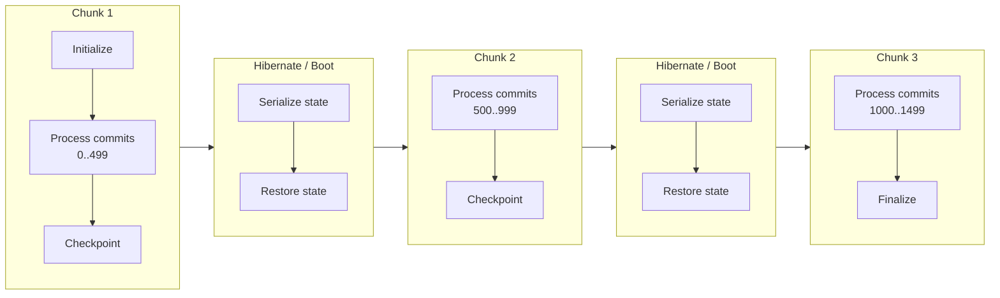
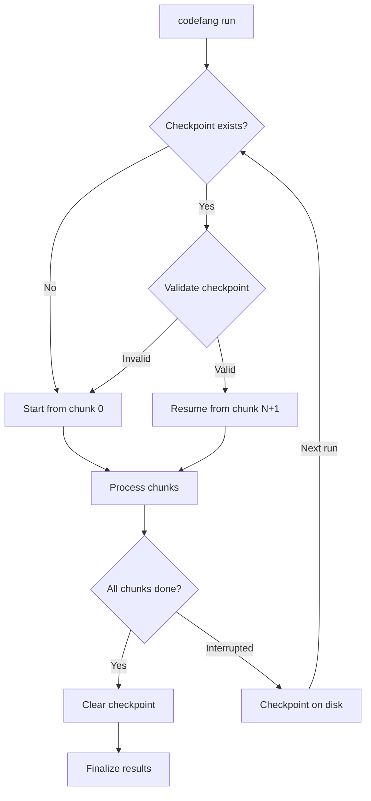

# Streaming Pipeline

Large Git repositories (tens or hundreds of thousands of commits) can easily
exhaust available memory if all analyzer state is accumulated in a single pass.
The streaming pipeline solves this by splitting commit history into
memory-bounded **chunks**, processing each chunk independently with
**hibernate/boot cycles** between them.

---

## The Problem

History analyzers accumulate state as they process commits. For example:

- **Burndown** tracks per-line ownership matrices that grow with repository size.
- **Couples** builds file co-change adjacency matrices.
- **Devs** accumulates per-developer statistics across languages.

For a 100k-commit repository, a naive single-pass approach may require 10+ GiB
of memory. Many CI environments and containers are limited to 2-8 GiB.

---

## The Solution: Chunk-Based Processing

The streaming pipeline:

1. **Plans** chunk boundaries based on memory budget and per-analyzer growth rates.
2. **Processes** each chunk by feeding commits to analyzers.
3. **Hibernates** analyzers between chunks (serialize state to compact form).
4. **Boots** analyzers for the next chunk (restore from compact state).
5. **Checkpoints** after each chunk for crash recovery.



---

## The Planner

The `streaming.Planner` calculates optimal chunk boundaries. It lives in
`pkg/streaming/planner.go`.

### Parameters

| Parameter | Value | Description |
|-----------|-------|-------------|
| `MinChunkSize` | 50 | Minimum commits per chunk to amortize hibernation cost |
| `MaxChunkSize` | 3,000 | Safety cap on commits per chunk |
| `BaseOverhead` | 400 MiB | Fixed memory for Go runtime + libgit2 + caches |
| `DefaultStateGrowthPerCommit` | 500 KiB | Conservative fallback per-commit growth rate |
| `SafetyMarginPercent` | 50% | Added to growth rate for transient allocations |

### Chunk Size Calculation

The planner determines chunk size using this formula:

```
available = memory_budget - overhead
growth    = aggregate_growth_per_commit * 1.5  (safety margin)
chunk_size = clamp(available / growth, MinChunkSize, MaxChunkSize)
```

Where:

- **`memory_budget`** is set via `--memory-budget` (e.g., `4GiB`).
- **`overhead`** is `BaseOverhead` (400 MiB) or the pipeline's estimated overhead if known.
- **`aggregate_growth_per_commit`** is the sum of all selected leaf analyzers' declared growth rates. Analyzers that implement the `MemoryWeighter` interface declare their per-commit growth; others default to 500 KiB.

### MemoryWeighter Interface

Analyzers can declare their per-commit memory growth:

```go
type MemoryWeighter interface {
    StateGrowthPerCommit() int64
}
```

The planner sums these across all selected leaf analyzers. If an analyzer does
not implement this interface, `DefaultStateGrowthPerCommit` (500 KiB) is used
as a conservative fallback.

### Example

For a 10,000-commit repo with 4 GiB budget and 2 MiB/commit aggregate growth:

```
available  = 4 GiB - 400 MiB = 3,696 MiB
growth     = 2 MiB * 1.5     = 3 MiB/commit
chunk_size = 3,696 / 3       = 1,232 commits
chunks     = ceil(10,000 / 1,232) = 9 chunks
```

---

## Double-Buffered Chunk Pipelining

When the memory budget is sufficient and multiple chunks are needed, the
pipeline enables **double-buffered pipelining** to overlap the pipeline stage
of chunk K+1 with the analyzer consumption stage of chunk K.

### The Insight

Processing a chunk has two phases:

1. **Pipeline phase**: The Coordinator runs git operations (blob loading, tree
   diffs, UAST parsing) through its worker pool. This is I/O-bound.
2. **Consume phase**: Analyzers consume the collected `CommitData` and update
   their state. This is CPU/memory-bound.

These two phases use different resources and can overlap.

### How It Works

```
                    Time ───────────────────────────────────────────>

Chunk 1:  |==== Pipeline ====|==== Consume ====|
Chunk 2:                     |==== Pipeline ====|==== Consume ====|
Chunk 3:                                        |==== Pipeline ====|==== Consume ====|

                              ^^^^^^^^^^^^^^^^
                              Pipeline 2 overlaps with Consume 1
```

The ASCII timeline above shows how double-buffering works:

1. **Chunk 1** runs normally (no prefetch available yet).
2. While Chunk 1's analyzers **consume** data, Chunk 2's **pipeline** runs
   concurrently in a background goroutine (`startPrefetch`).
3. When Chunk 1's consume phase finishes, Chunk 2's pipeline data is already
   available -- analyzers can consume it immediately without waiting for I/O.
4. The pattern repeats for subsequent chunks.

### Memory Budget Split

When double-buffering is active, the memory budget is split to accommodate two
concurrent analyzer states:

```
total_budget = overhead + state_budget
state_for_two = total_budget - overhead
per_slot = state_for_two / 2
synthetic_overhead = overhead + per_slot  (fed to planner as "overhead")
```

This results in smaller chunk sizes (more chunks), but the pipeline overlap
compensates by eliminating I/O wait time between chunks.

### Activation Conditions

Double-buffering activates when **all** of these conditions are met:

| Condition | Rationale |
|-----------|-----------|
| At least 2 chunks planned | No benefit with a single chunk |
| `memoryBudget > 0` | Budget must be explicitly set |
| `available >= 2 * MinChunkSize * DefaultStateGrowthPerCommit` | Enough memory for two concurrent states |

When conditions are not met, the pipeline falls back to sequential chunk
processing.

---

## Hibernate / Boot Cycles

Between chunks, the pipeline calls `Hibernate()` on all hibernatable analyzers,
then `Boot()` to restore them for the next chunk.

```go
type Hibernatable interface {
    Hibernate() error  // Serialize state to compact form
    Boot() error       // Restore from compact state
}
```

Hibernation compacts in-memory data structures. For example, the burndown
analyzer may convert dense matrices to sparse representations. Some analyzers
support disk-backed hibernation for very large state.

The hibernate/boot cycle adds overhead per chunk boundary, which is why
`MinChunkSize` (50 commits) exists to amortize this cost.

---

## Checkpointing

After each fully processed chunk (except the last), the pipeline saves a
checkpoint to disk. If the process is interrupted (OOM kill, pod eviction,
timeout), the next run with `--resume` automatically restarts from the last
completed chunk.

### Checkpoint Contents

| Field | Description |
|-------|-------------|
| `TotalCommits` | Total commits in the repository |
| `ProcessedCommits` | Number of commits processed so far |
| `CurrentChunk` | Index of the last completed chunk |
| `TotalChunks` | Total planned chunk count |
| `LastCommitHash` | Hash of the last processed commit |
| Analyzer state | Serialized state of all checkpointable analyzers |

### Checkpointable Interface

```go
type Checkpointable interface {
    CheckpointSave(w io.Writer) error
    CheckpointLoad(r io.Reader) error
}
```

!!! info "Full Coverage Required"
    Checkpoint resume only activates when **all** analyzers in the pipeline
    implement `Checkpointable`. If any analyzer lacks support, checkpointing
    is disabled with a warning.

### CLI Flags

| Flag | Default | Description |
|------|---------|-------------|
| `--checkpoint` | `true` | Enable checkpointing |
| `--resume` | `true` | Resume from checkpoint if available |
| `--checkpoint-dir` | `~/.codefang/checkpoints` | Checkpoint storage directory |
| `--clear-checkpoint` | `false` | Clear existing checkpoint before run |

### Crash Recovery Flow



---

## Full Pipeline Timeline

The following diagram shows the complete lifecycle of a streaming analysis
run with double-buffered pipelining and checkpointing:

```
Time ──────────────────────────────────────────────────────────────────────>

Phase:     INIT        CHUNK 1                    CHUNK 2                    CHUNK 3         FINALIZE
           ┌───┐       ┌─────────────────────┐    ┌─────────────────────┐    ┌──────────┐    ┌───────┐
Main:      │INI│       │Pipeline│   Consume   │    │Consume (prefetched)│    │Pipe│Consu│    │REPORT │
           └───┘       └────────┴─────────────┘    └────────────────────┘    └────┴─────┘    └───────┘
                                │                   │                         │
Background:                     │  ┌────────────┐   │   ┌────────────┐       │
(prefetch)                      └──│Pipeline C2  │   └───│Pipeline C3  │      │
                                   └────────────┘       └────────────┘       │
                                                                             │
Checkpoint:              [save]                   [save]                      │
                           │                        │                        │
                           v                        v                        │
Disk:              [chunk_0.ckpt]           [chunk_1.ckpt]            [clear on success]

Hibernate:                      [hib][boot]              [hib][boot]
```

### Legend

| Symbol | Meaning |
|--------|---------|
| `INI` | `runner.Initialize()` -- set up analyzers |
| `Pipeline` | Coordinator worker pool: blob, diff, UAST stages |
| `Consume` | Analyzers process CommitData sequentially |
| `[hib][boot]` | Hibernate/boot cycle between chunks |
| `[save]` | Checkpoint saved to disk |
| `REPORT` | `runner.Finalize()` -- generate output |

---

## Configuration Recommendations

### Memory Budget by Repository Size

| Repository Size | Recommended `--memory-budget` | Expected Chunks |
|-----------------|-------------------------------|-----------------|
| < 1k commits | `2GiB` | 1 (no streaming) |
| 1k -- 10k commits | `4GiB` | 2 -- 10 |
| 10k -- 100k commits | `4GiB` -- `8GiB` | 10 -- 100+ |
| 100k+ commits | `8GiB` | Many, checkpointing essential |

### Tuning Tips

!!! tip "Let the planner decide"
    In most cases, setting `--memory-budget` is sufficient. The planner
    automatically calculates optimal chunk sizes based on the selected
    analyzers' declared growth rates.

- **More analyzers = smaller chunks**: Each analyzer adds to the aggregate
  growth rate, reducing the number of commits that fit in each chunk.
- **Burndown is the heaviest**: The burndown analyzer has the highest
  per-commit growth rate. If you do not need burndown, your chunks will be
  larger and runs faster.
- **Checkpointing adds ~5% overhead**: The serialization cost per chunk
  boundary is small but non-zero.
- **Double-buffering shines on I/O-bound repos**: Repositories with large
  blobs benefit most from overlapping pipeline and consume phases.

---

## Observability

The streaming pipeline emits OpenTelemetry spans and metrics for monitoring:

### Spans

| Span | Attributes |
|------|------------|
| `codefang.analysis` | `analysis.chunks`, `analysis.chunk_size`, `analysis.double_buffered` |
| Per-chunk events | `chunk.index`, `chunk.offset`, `chunk.size`, `chunk.duration_ms` |
| `checkpoint.saved` | `chunk` index |
| `checkpoint.resumed` | `chunk` index |

### Metrics

| Metric | Type | Description |
|--------|------|-------------|
| `codefang.analysis.commits.total` | Counter | Total commits analyzed |
| `codefang.analysis.chunks.total` | Counter | Total chunks processed |
| `codefang.analysis.chunk.duration.seconds` | Histogram | Per-chunk processing duration |
| `codefang.analysis.cache.hits.total` | Counter | Cache hits (blob, diff) |
| `codefang.analysis.cache.misses.total` | Counter | Cache misses (blob, diff) |

The analysis span also records aggregate pipeline timing (blob, diff, UAST
stage durations) and cache statistics, with the dominant stage identified
automatically.
