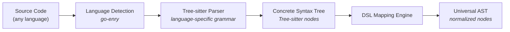
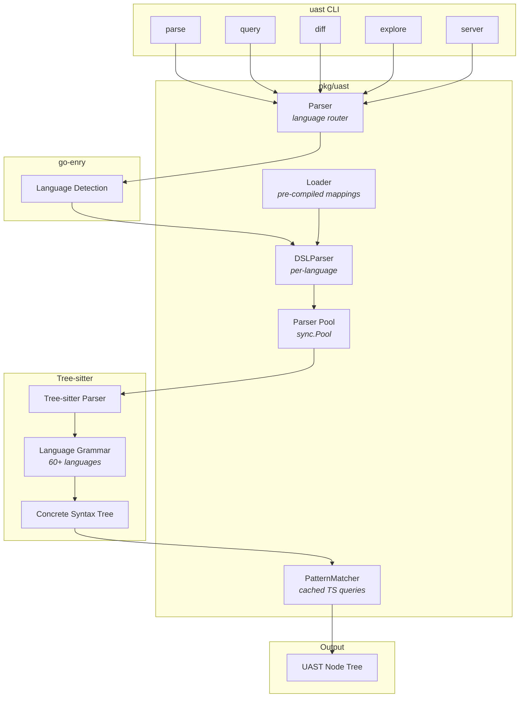

# UAST System

The **Universal Abstract Syntax Tree** (UAST) is Codefang's language-agnostic
code representation. It normalizes the wildly different ASTs produced by
language-specific parsers into a common schema with consistent node types,
roles, and properties -- enabling analyzers to work across 60+ languages
with a single implementation.

---

## What is UAST?

A UAST is a tree of nodes where each node has:

| Field | Type | Description |
|-------|------|-------------|
| `type` | string | Semantic node type: `Function`, `Class`, `Import`, `Expression`, etc. |
| `token` | string | The literal text token (for leaf nodes) |
| `roles` | list | Semantic roles: `Declaration`, `Function`, `Statement`, `Expression`, etc. |
| `pos` | object | Source positions: start/end line, column, byte offset |
| `props` | map | Key-value properties (e.g., `name`, `visibility`) |
| `children` | list | Child UAST nodes |

Example UAST node for a Go function:

```json
{
  "type": "Function",
  "token": "processData",
  "roles": ["Declaration", "Function"],
  "pos": {
    "start": { "line": 10, "col": 1, "offset": 245 },
    "end": { "line": 25, "col": 2, "offset": 612 }
  },
  "props": {
    "name": "processData"
  },
  "children": [...]
}
```

---

## Tree-sitter Under the Hood

Codefang uses [Tree-sitter](https://tree-sitter.github.io/) as the parsing
backend. Tree-sitter provides:

- **Incremental parsing** -- only re-parses changed regions
- **Error recovery** -- produces partial trees even for malformed code
- **60+ language grammars** compiled into the binary via [go-sitter-forest](https://github.com/alexaandru/go-sitter-forest)
- **Zero runtime dependencies** -- all grammars are statically linked

The parsing flow:



### Language Detection

File language is detected using the [go-enry](https://github.com/go-enry/go-enry)
library, which uses filename, extension, and content heuristics (the same
algorithm as GitHub's Linguist). You can override detection with the
`--language` / `-l` flag.

### Performance Optimizations

The UAST parser includes several performance optimizations for high-throughput
analysis:

- **Parser pool**: `sync.Pool` of Tree-sitter parsers to avoid re-allocation across files.
- **Pre-interned types and roles**: DSL rule strings are interned at load time, eliminating repeated allocations.
- **Per-parse string interning**: Short strings (32 bytes or less) are deduplicated within each parse call.
- **O(1) rule lookup**: Rule index by node type replaces linear scan.
- **Batch child reading**: Uses unsafe batch reads for nodes with 8+ children, avoiding per-child CGO overhead.
- **Zero-copy text comparison**: `unsafeNodeText` provides zero-allocation string views for condition evaluation.
- **Cursor pooling**: Tree-sitter cursors are pooled and reused across recursive calls within a single parse.
- **Arena allocator**: Node allocation uses a per-parse arena (`node.Allocator`) to reduce GC pressure.

---

## DSL Mapping Engine

The DSL (Domain-Specific Language) is how Tree-sitter's language-specific
concrete syntax tree nodes are mapped to universal UAST node types. Each
language has a `.uast` mapping file that declares the transformation rules.

### DSL Syntax Overview

A mapping file consists of:

1. A **language declaration** with name and file extensions.
2. One or more **mapping rules** that match Tree-sitter node types and produce UAST nodes.

```
language go [.go]

function_declaration <- (function_declaration
    name: (identifier) @name
    body: (block) @body
) => uast(
    type: "Function",
    token: "@name",
    roles: "Declaration", "Function",
    children: "@body"
)
```

### Rule Anatomy

Each rule has four parts:

```
<rule_name> <- (<tree-sitter-pattern>) => uast(<uast-spec>)
```

| Part | Description |
|------|-------------|
| `rule_name` | The Tree-sitter node type this rule matches (e.g., `function_declaration`) |
| `tree-sitter-pattern` | A Tree-sitter query pattern with named captures (`@name`, `@body`) |
| `uast-spec` | The UAST node specification: type, token, roles, props, children |

### UAST Spec Fields

| Field | Description | Example |
|-------|-------------|---------|
| `type` | UAST node type | `"Function"`, `"Class"`, `"Import"` |
| `token` | Token extraction source | `"@name"`, `"self"`, `"text"`, `"fields.name"`, `"child:identifier"`, `"descendant:identifier"` |
| `roles` | Comma-separated semantic roles | `"Declaration", "Function"` |
| `props` | Key-value properties | `name: "@name", visibility: "public"` |
| `children` | Child capture reference | `"@body"` |

### Token Sources

| Source | Description |
|--------|-------------|
| `@capture_name` | Text from a named capture in the Tree-sitter pattern |
| `self` / `text` | The full text of the matched node |
| `fields.name` | The `name` field of the Tree-sitter node |
| `child:<type>` | Text of the first child of the specified type |
| `descendant:<type>` | Text of the first descendant of the specified type |

### Conditions

Rules can include conditions that filter matches:

```
public_method <- (method_declaration
    name: (identifier) @name
) where (visibility == "public") => uast(
    type: "Function",
    token: "@name",
    roles: "Declaration", "Function", "Public"
)
```

Conditions support `==` and `!=` operators, comparing fields, captures, or
child types against string literals.

### Inheritance

Rules can extend other rules to avoid duplication:

```
base_function <- (function_declaration) => uast(
    type: "Function",
    roles: "Declaration", "Function"
)

arrow_function <- extends base_function (arrow_function) => uast(
    type: "Function",
    roles: "Declaration", "Function", "Lambda"
)
```

The child rule inherits all fields from the base rule and can override any of
them. Inheritance is resolved recursively.

---

## Role System

UAST roles classify what a node **does** semantically, independent of language
syntax. A single node can have multiple roles.

### Common Roles

| Role | Description | Examples |
|------|-------------|---------|
| `Declaration` | Declares a new name | Function def, class def, variable def |
| `Function` | Function-related | Function declaration, function call |
| `Expression` | An expression | Binary expression, call expression |
| `Statement` | A statement | If, for, return, assignment |
| `Type` | Type-related | Type annotation, type parameter |
| `Literal` | A literal value | String, number, boolean |
| `Comment` | A comment | Line comment, block comment |
| `Import` | An import | Import statement, require call |
| `Identifier` | A name reference | Variable name, function name |
| `Operator` | An operator | `+`, `-`, `==`, `&&` |
| `Call` | A function/method call | `foo()`, `obj.method()` |
| `Return` | Return from function | `return x` |
| `Assignment` | Value assignment | `x = 5`, `let y = ...` |
| `Condition` | Conditional logic | `if`, `switch`, ternary |
| `Loop` | Iteration | `for`, `while`, `forEach` |
| `Class` | Class/struct definition | `class Foo`, `struct Bar` |
| `Public` | Public visibility | Public methods, exported functions |
| `Private` | Private visibility | Private methods, unexported functions |
| `Lambda` | Anonymous function | Arrow functions, closures |

---

## Writing Custom Mappings

To add or customize language mappings:

### Step 1: Create a Mapping File

Create a `.uast` file for your language:

```
language rust [.rs]

fn_item <- (function_item
    name: (identifier) @name
    body: (block) @body
) => uast(
    type: "Function",
    token: "@name",
    roles: "Declaration", "Function",
    children: "@body"
)

struct_item <- (struct_item
    name: (type_identifier) @name
    body: (field_declaration_list) @body
) => uast(
    type: "Class",
    token: "@name",
    roles: "Declaration", "Class",
    children: "@body"
)

impl_item <- (impl_item
    type: (type_identifier) @name
    body: (declaration_list) @body
) => uast(
    type: "Class",
    token: "@name",
    roles: "Declaration", "Class", "Implementation",
    children: "@body"
)

use_declaration <- (use_declaration
    argument: (_) @path
) => uast(
    type: "Import",
    token: "@path",
    roles: "Import"
)

line_comment <- (line_comment) => uast(
    type: "Comment",
    token: "self",
    roles: "Comment"
)
```

### Step 2: Test with the UAST CLI

```bash
# Parse a file with your custom mapping
uast parse --language rust main.rs

# Explore the raw Tree-sitter AST to discover node types
uast explore main.rs

# Query specific node types
uast query -e 'filter(.type == "Function")' main.rs
```

### Step 3: Iterate

Use `uast explore` to inspect the Tree-sitter CST and discover which node
types and field names are available for your target language. Then write
mapping rules to convert them to UAST types.

### Pre-compiled Mappings

For production performance, language mappings are pre-compiled into the binary.
The DSL is parsed once at startup and the resulting `PatternMatcher` caches
compiled Tree-sitter queries for O(1) lookup during parsing.

The `DSLParser` pre-interns all Type and Role strings from the mapping rules,
so repeated files of the same language share the same string values without
allocation.

---

## UAST CLI Commands

The `uast` binary provides five commands for working with Universal ASTs.

### `uast parse`

Parse source files into UAST format.

```bash
uast parse main.go                      # Parse a single file
uast parse *.go                          # Parse multiple files
uast parse -l python script.py           # Force language
uast parse -f json -o output.json main.go  # JSON to file
uast parse --all                         # Parse entire codebase
cat main.go | uast parse -               # Parse from stdin
```

| Flag | Description | Default |
|------|-------------|---------|
| `-l, --language` | Force language detection | auto-detect |
| `-o, --output` | Output file path | stdout |
| `-f, --format` | Output format: `json`, `compact` | `json` |
| `-p, --progress` | Show progress for multiple files | `false` |
| `--all` | Parse all source files recursively | `false` |

### `uast query`

Query UAST nodes using filter expressions.

```bash
uast query -e 'filter(.type == "Function")' main.go
uast query -i ast.json -e 'filter(.roles has "Declaration")'
uast query --interactive main.go         # REPL mode
```

| Flag | Description | Default |
|------|-------------|---------|
| `-e` | Query expression | (required) |
| `-i, --input` | Input UAST JSON file | (parse from source) |
| `-f, --format` | Output format: `json`, `compact` | `json` |
| `--interactive` | Interactive REPL mode | `false` |

### `uast diff`

Compare UAST trees of two files.

```bash
uast diff old_version.go new_version.go
uast diff -f json file_v1.py file_v2.py
```

| Flag | Description | Default |
|------|-------------|---------|
| `-o, --output` | Output file path | stdout |
| `-f, --format` | Output format: `json`, `compact` | `json` |

### `uast explore`

Interactively explore the AST structure of a file.

```bash
uast explore main.go                     # Explore full AST
uast explore -l python script.py         # Force language
```

| Flag | Description | Default |
|------|-------------|---------|
| `-l, --language` | Force language detection | auto-detect |

### `uast server`

Start an HTTP server for UAST operations (useful for editor integrations and
development).

```bash
uast server                              # Default port
uast server --port 8080                  # Custom port
```

The server exposes REST endpoints for parsing, querying, and retrieving
language mappings, with full OpenTelemetry instrumentation.

---

## Architecture Diagram



---

## Integration with Analyzers

The UAST system is used by both static and history analyzers:

**Static analyzers** parse source files directly:

- `static/complexity` -- counts decision points in `Function` nodes
- `static/cohesion` -- measures method coupling within `Class` nodes
- `static/halstead` -- counts operators and operands across the tree
- `static/comments` -- measures `Comment` node density relative to code
- `static/imports` -- extracts `Import` nodes for dependency graphs

**History analyzers** receive UAST diffs through the plumbing layer:

- `history/sentiment` -- analyzes sentiment of `Comment` nodes across commits
- `history/shotness` -- tracks change frequency of `Function` nodes
- `history/typos` -- detects identifier typos in UAST diffs
- `history/quality` -- tracks UAST-based quality metrics over time

The `plumbing.UASTChangesAnalyzer` parses both the before and after versions
of changed files, providing history analyzers with UAST diff information
for each commit.
