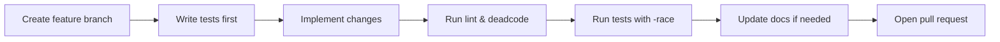

# Contributing to Codefang

Welcome to the Codefang project! We are glad you are interested in contributing.
Whether you are fixing a bug, adding a new analyzer, improving documentation, or
proposing a feature, every contribution makes Codefang better for the entire
community.

This guide covers everything you need to get started, from setting up your
development environment to submitting a pull request.

---

## Getting Started

### Prerequisites

| Tool | Version | Purpose |
|------|---------|---------|
| **Go** | 1.24+ | Primary language |
| **CMake** | 3.14+ | Building vendored libgit2 |
| **Python 3** | 3.10+ | Benchmark scripts, code generation |
| **Git** | 2.30+ | Version control |

### Fork, Clone, and Build

1. **Fork** the repository on GitHub.

2. **Clone** your fork locally:

    ```bash
    git clone https://github.com/<your-username>/codefang.git
    cd codefang
    ```

3. **Build** the project (this also compiles vendored libgit2):

    ```bash
    make build
    ```

4. **Run the tests** to verify everything works:

    ```bash
    make test
    ```

!!! tip "First build takes longer"
    The initial `make build` compiles libgit2 from source and pre-compiles
    UAST mappings. Subsequent builds are incremental and much faster.

---

## Development Workflow

Codefang follows a test-driven, branch-based workflow. Here is the recommended
sequence for every change:



### 1. Create a Feature Branch

Always branch from `main`:

```bash
git checkout main
git pull origin main
git checkout -b feat/my-new-feature
```

### 2. Write Tests First (TDD)

Write failing tests that describe the expected behavior **before** writing
implementation code. Codefang uses table-driven tests extensively:

```go
func TestMyFeature(t *testing.T) {
    tests := []struct {
        name     string
        input    string
        expected int
    }{
        {name: "empty input", input: "", expected: 0},
        {name: "single item", input: "a", expected: 1},
    }

    for _, tt := range tests {
        t.Run(tt.name, func(t *testing.T) {
            got := MyFeature(tt.input)
            if got != tt.expected {
                t.Errorf("MyFeature(%q) = %d, want %d", tt.input, got, tt.expected)
            }
        })
    }
}
```

### 3. Implement Changes

Write the minimal code to make the tests pass. Keep functions focused and
interfaces small.

### 4. Run Linting and Dead Code Analysis

```bash
make lint
make deadcode
```

### 5. Run Tests (with Race Detector)

```bash
make test
```

!!! note
    The test suite runs with the Go race detector enabled in CI. Ensure your
    code is free of data races before pushing.

### 6. Update Documentation

If your change affects user-facing behavior, CLI flags, configuration options,
or analyzer output, update the relevant documentation under `site/`.

---

## Code Standards

### Language and Style

- **Go 1.24+** -- use modern language features where they improve clarity.
- Write **idiomatic Go** -- follow [Effective Go](https://go.dev/doc/effective_go)
  and the [Go Code Review Comments](https://github.com/golang/go/wiki/CodeReviewComments).
- Run `make fmt` before committing.

### Testing

- Use **table-driven tests** for any function with more than one meaningful input.
- Name test cases descriptively (e.g., `"empty repository returns zero commits"`).
- Place test helpers in the same package with a `_test.go` suffix.

### Context Propagation

- Pass `context.Context` as the first parameter through all public APIs.
- **Never** use `context.Background()` in hot paths -- propagate the caller's
  context so that cancellation and tracing work correctly.

```go
// Good
func Analyze(ctx context.Context, repo *Repository) (Result, error) { ... }

// Bad -- loses cancellation and trace spans
func Analyze(repo *Repository) (Result, error) {
    ctx := context.Background() // don't do this
    ...
}
```

### Structured Logging

Use `log/slog` for all logging. Include relevant key-value pairs:

```go
slog.InfoContext(ctx, "analysis complete",
    "analyzer", name,
    "commits", commitCount,
    "duration", elapsed,
)
```

### Functional Options

Use the functional options pattern for constructors with optional configuration:

```go
type Option func(*Runner)

func WithWorkers(n int) Option {
    return func(r *Runner) { r.workers = n }
}

func NewRunner(opts ...Option) *Runner {
    r := &Runner{workers: runtime.NumCPU()}
    for _, opt := range opts {
        opt(r)
    }
    return r
}
```

### Interface Design

- Keep interfaces **small** -- aim for a maximum of **5 methods**.
- Define interfaces at the **consumer** site, not the producer.
- Prefer standard library interfaces (`io.Reader`, `io.Writer`, `fmt.Stringer`)
  when they fit.

### Error Handling

Wrap errors with context using `fmt.Errorf` and the `%w` verb:

```go
if err != nil {
    return fmt.Errorf("parsing commit %s: %w", hash, err)
}
```

!!! warning "Do not discard errors"
    Every error must be either returned, logged, or explicitly documented as
    intentionally ignored with a comment.

---

## Commit Conventions

Codefang uses [Conventional Commits](https://www.conventionalcommits.org/) to
produce clean changelogs and enable automated versioning.

| Prefix | Purpose | Example |
|--------|---------|---------|
| `feat` | New feature | `feat: add timeseries output format` |
| `fix` | Bug fix | `fix: correct off-by-one in burndown bands` |
| `refactor` | Code restructuring (no behavior change) | `refactor: extract blob cache into separate package` |
| `test` | Adding or updating tests | `test: add table-driven tests for anomaly detector` |
| `docs` | Documentation changes | `docs: add MCP integration guide` |
| `perf` | Performance improvement | `perf: reduce allocations in tree diff` |
| `chore` | Maintenance tasks | `chore: update libgit2 to v1.9.1` |

**Format:**

```
<type>(<optional scope>): <description>

<optional body>

<optional footer>
```

??? example "Full commit message example"

    ```
    feat(analyzers): add anomaly detection analyzer

    Implements Z-score and IQR based anomaly detection for commit-level
    metrics. Integrates with the streaming pipeline and supports
    checkpointing for crash recovery.

    Closes #142
    ```

---

## Pull Request Process

### Before Opening a PR

- [ ] All tests pass locally (`make test`)
- [ ] Linting is clean (`make lint`)
- [ ] Dead code analysis passes (`make deadcode`)
- [ ] Commit messages follow conventional commits
- [ ] Documentation is updated if needed

### PR Description Template

When opening a pull request, include:

1. **Scope** -- What does this PR change and why?
2. **Test matrix** -- What tests were added or modified? What edge cases are covered?
3. **Link to FRD/BUG** -- Reference any related feature request document or bug issue (e.g., `Closes #123`).
4. **Breaking changes** -- Call out any breaking changes to public APIs or output formats.

!!! info "Review turnaround"
    Maintainers aim to review PRs within 48 hours. Complex changes may take
    longer. Feel free to ping if you have not received feedback after a week.

---

## Make Targets Reference

The project `Makefile` provides a comprehensive set of targets for development:

| Target | Description |
|--------|-------------|
| `make build` | Build all binaries (includes libgit2 compilation) |
| `make test` | Run the full test suite |
| `make lint` | Run `golangci-lint` and deadcode analysis |
| `make deadcode` | Run deadcode analysis with whitelist filter |
| `make bench` | Run comprehensive UAST benchmark suite |
| `make fmt` | Format all Go source files |
| `make schemas` | Generate JSON schemas for all analyzers |
| `make otel-up` | Start local OpenTelemetry stack (Jaeger + Prometheus) |
| `make otel-down` | Stop the local OpenTelemetry stack |
| `make demo` | Run a demo analysis with tracing against the local OTel stack |
| `make install` | Install binaries to `~/.local/bin` |
| `make clean` | Remove all build artifacts |
| `make battle` | Battle test on a large repo with CPU and heap profiles |

??? tip "Useful development targets"

    ```bash
    # Run only UAST benchmarks with profiling
    make benchcpu

    # Compare burndown output with reference
    make compare-burndown REPO=~/sources/myrepo

    # Find out why a function is considered live
    make deadcode-why FUNC=MyFunction

    # Start the UAST development UI
    make uast-dev
    ```

---

## Reporting Bugs

Found a bug? Please [open a GitHub Issue](https://github.com/Sumatoshi-tech/codefang/issues/new)
with the following information:

1. **Codefang version** -- output of `codefang --version`
2. **Operating system and architecture** -- e.g., `Linux x86_64`, `macOS arm64`
3. **Steps to reproduce** -- minimal command or configuration to trigger the bug
4. **Expected behavior** -- what you expected to happen
5. **Actual behavior** -- what actually happened (include error messages and stack traces)
6. **Repository** (if applicable) -- a public repository or minimal reproducer

!!! tip "Debugging tips"
    Run with `--debug-trace` and set `OTEL_EXPORTER_OTLP_ENDPOINT` to capture
    a full trace of the analysis run. This helps maintainers diagnose issues
    faster.

---

## Feature Requests

Have an idea for a new analyzer, output format, or integration? We welcome
feature requests. Please [open a GitHub Issue](https://github.com/Sumatoshi-tech/codefang/issues/new)
and include:

1. **Use case** -- describe the problem you are trying to solve.
2. **Expected behavior** -- what the feature should do, including example input
   and output if possible.
3. **Alternatives considered** -- any workarounds you have tried or other tools
   that provide similar functionality.

---

## Thank You

Every contribution, no matter how small, helps make Codefang a better tool.
Thank you for being part of the community.
