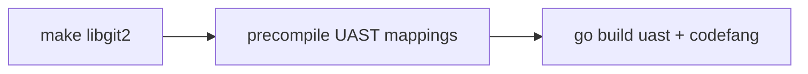

# Installation

This guide covers every way to install Codefang and its companion UAST parser.

---

## Prerequisites

Before you begin, make sure the following tools are available on your system:

| Requirement | Minimum Version | Notes |
|-------------|-----------------|-------|
| **Go** | 1.24+ | Required for `go install` and building from source |
| **Git** | 2.x | Used by history analyzers to walk repository objects |
| **C compiler** | GCC or Clang | CGO is required for libgit2 bindings |
| **CMake** | 3.14+ | Needed when building libgit2 from the vendored source |
| **OpenSSL** (dev headers) | 1.1+ | libgit2 HTTPS transport dependency |

!!! info "CGO is required"
    Codefang links against **libgit2** for high-performance Git repository
    access. The library is vendored and built automatically, but a working C
    toolchain and `CGO_ENABLED=1` (the Go default) are mandatory.

---

## Install from Source (Recommended)

The fastest way to get both binaries:

```bash
go install github.com/Sumatoshi-tech/codefang/cmd/codefang@latest
go install github.com/Sumatoshi-tech/codefang/cmd/uast@latest
```

This places `codefang` and `uast` in your `$GOPATH/bin` (or `$GOBIN` if set).
Make sure that directory is on your `$PATH`:

```bash
export PATH="$(go env GOPATH)/bin:$PATH"
```

!!! tip "Add to your shell profile"
    Append the `export` line above to your `~/.bashrc`, `~/.zshrc`, or
    equivalent so the binaries are always available.

---

## Build from Source

For contributors or when you need a custom build:

```bash
git clone https://github.com/Sumatoshi-tech/codefang.git
cd codefang
make build    # (1)!
make install  # (2)!
```

1. Builds libgit2, pre-compiles UAST mappings, then compiles both `uast` and `codefang` into `build/bin/`.
2. Copies the binaries to `~/.local/bin/`. The Makefile will warn you if that directory is not on your `$PATH`.

### What `make build` does

The build process has three stages:



1. **libgit2** -- The vendored C library in `third_party/libgit2` is compiled
   as a static archive via CMake. This only happens once (subsequent builds
   skip it if the artifact already exists).
2. **UAST mappings** -- A code-generation step pre-compiles Tree-sitter
   language mappings into `pkg/uast/embedded_mappings.gen.go` for faster
   startup.
3. **Go build** -- Both binaries are compiled with version/commit metadata
   injected via `-ldflags`.

### Building libgit2 Separately

If you only need to rebuild the native library:

```bash
make libgit2
```

The static archive is installed to `third_party/libgit2/install/`. The Makefile
automatically sets `PKG_CONFIG_PATH`, `CGO_CFLAGS`, and `CGO_LDFLAGS` so that
subsequent Go builds find it.

---

## Docker

A multi-stage `Dockerfile` is included at the repository root:

```bash
docker build -t codefang .
```

Run analysis on a local repository:

```bash
docker run --rm -v "$(pwd):/repo" codefang run -a static/complexity /repo
```

Run history analysis (the container needs the full `.git` directory):

```bash
docker run --rm -v "$(pwd):/repo" codefang run -a history/burndown --format yaml /repo
```

!!! note "Image size"
    The production image is built on a minimal base. The libgit2 static
    library and Tree-sitter grammars are embedded at build time, so no
    additional runtime dependencies are needed inside the container.

---

## Verify Installation

After installing, confirm both binaries are working:

=== "codefang"

    ```bash
    $ codefang --version
    codefang version v0.1.0 (abc1234) built 2026-01-15T10:00:00Z
    ```

=== "uast"

    ```bash
    $ uast --version
    uast version v0.1.0 (abc1234) built 2026-01-15T10:00:00Z
    ```

If either command is not found, verify that the installation directory is on
your `$PATH`:

```bash
# For go install:
echo "$(go env GOPATH)/bin"

# For make install:
echo "$HOME/.local/bin"
```

---

## Platform Notes

### Linux

Fully supported. Install build essentials if you do not already have a C
compiler:

=== "Debian / Ubuntu"

    ```bash
    sudo apt-get install build-essential cmake libssl-dev pkg-config
    ```

=== "Fedora / RHEL"

    ```bash
    sudo dnf install gcc gcc-c++ cmake openssl-devel pkg-config
    ```

=== "Arch Linux"

    ```bash
    sudo pacman -S base-devel cmake openssl pkg-config
    ```

### macOS

Fully supported. Xcode Command Line Tools provide the required C toolchain:

```bash
xcode-select --install
brew install cmake openssl pkg-config
```

!!! warning "Apple Silicon"
    On ARM-based Macs you may need to point `pkg-config` at the Homebrew
    OpenSSL installation:

    ```bash
    export PKG_CONFIG_PATH="$(brew --prefix openssl)/lib/pkgconfig:$PKG_CONFIG_PATH"
    ```

### Windows

Not officially supported at this time. You can use **WSL 2** with a Linux
distribution and follow the Linux instructions above.

---

## Next Steps

With both binaries installed, head to the [Quick Start](quickstart.md) guide
to run your first analysis.
