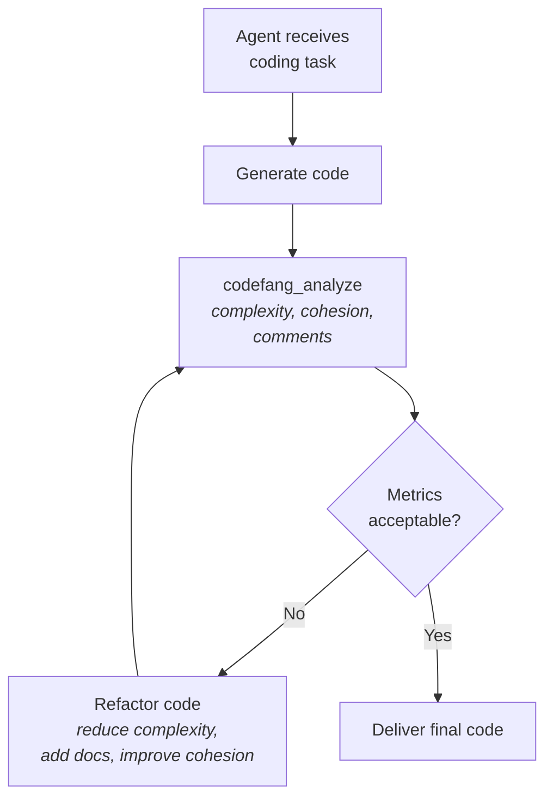
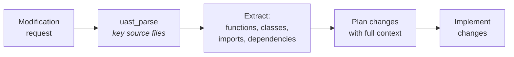
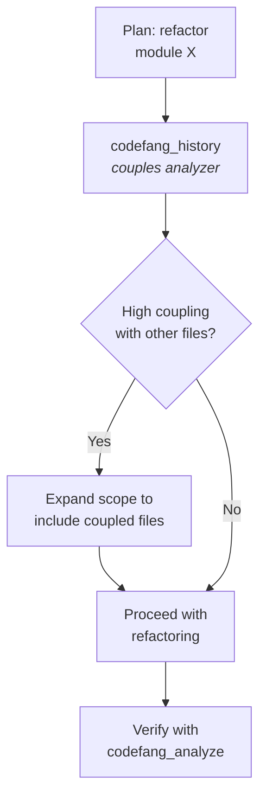
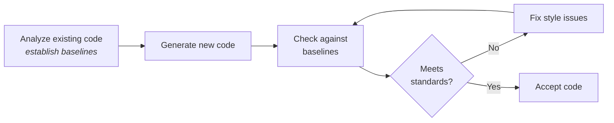

# Using Codefang with AI Agents

Codefang's MCP server and CLI tools enable powerful integration with AI coding
agents. Rather than treating code analysis as a one-off check, agents can use
Codefang **in the loop** -- analyzing code during generation, understanding
architecture before making changes, and verifying quality after modifications.

This guide covers proven patterns for agent-assisted development with Codefang.

---

## Integration Methods

| Method | Best For | Setup |
|--------|----------|-------|
| **MCP Server** | AI agents with MCP support (Claude Code, etc.) | `codefang mcp` in agent config |
| **CLI pipes** | Script-based agents, custom toolchains | `codefang run` in tool definitions |
| **Docker** | Sandboxed environments, CI agents | `docker run codefang` |

The MCP server is the recommended approach for AI agents, as it provides
structured tool discovery and invocation without parsing CLI output.
See the [MCP Server guide](mcp.md) for setup instructions.

---

## Pattern 1: Self-Correcting Code Generation

**Goal**: Generate code, check its quality, and automatically fix issues in a
feedback loop.

### How It Works



### Agent Workflow

1. The agent generates code for the requested feature.
2. It calls `codefang_analyze` with the generated code.
3. It inspects the results for:
    - Cyclomatic complexity > threshold (e.g., > 10 per function)
    - Comment density below target (e.g., < 20%)
    - Low cohesion scores
4. If any metric is out of bounds, the agent refactors and re-analyzes.
5. The loop repeats until all metrics pass.

### Example Agent Prompt

```
Generate a Go function that parses CSV files with configurable delimiters
and header handling. After generating the code, use codefang_analyze to
check complexity. If any function has cyclomatic complexity > 10, refactor
it into smaller functions and re-check.
```

### What the Agent Sees

```json
// Agent calls codefang_analyze with the generated code
{
  "name": "codefang_analyze",
  "arguments": {
    "code": "package csv\n\nfunc ParseCSV(data []byte, opts Options) ([][]string, error) {\n  // ... generated code ...\n}\n",
    "language": "go",
    "analyzers": ["complexity", "comments"]
  }
}
```

The response includes per-function metrics, allowing the agent to identify
exactly which functions need attention.

---

## Pattern 2: Architectural Context Injection

**Goal**: Help the agent understand existing code structure before making changes.

### How It Works

Before modifying a codebase, the agent parses key files to understand the
architecture -- function signatures, class hierarchies, import graphs, and
module boundaries.



### Agent Workflow

1. Agent receives a task like "Add caching to the database layer."
2. It calls `uast_parse` on the relevant source files.
3. From the UAST, it extracts:
    - Function signatures and their complexity
    - Class/struct definitions and their methods
    - Import dependencies between modules
    - Existing patterns (e.g., interface usage, error handling)
4. With this structural understanding, it plans and implements changes that
   are consistent with the existing codebase.

### Example: Understanding Module Structure

```json
{
  "name": "uast_parse",
  "arguments": {
    "code": "// contents of database/repository.go",
    "language": "go"
  }
}
```

The agent receives a full UAST tree with function declarations, their
parameters, return types, and body structure -- enough to understand the API
surface without reading every line.

---

## Pattern 3: Risk-Aware Refactoring

**Goal**: Understand file coupling and change risk before refactoring.

### How It Works

Before making structural changes, the agent runs `codefang_history` with the
`couples` analyzer to understand which files tend to change together. This
reveals hidden dependencies that may not be obvious from import graphs alone.



### Agent Workflow

1. Agent plans to refactor `pkg/database/queries.go`.
2. It calls `codefang_history` with the `couples` analyzer.
3. The results show that `queries.go` always changes with `migrations.go`
   and `repository.go`.
4. The agent expands its refactoring scope to include these coupled files.
5. After refactoring, it runs `codefang_analyze` to verify quality.

### Example

```json
{
  "name": "codefang_history",
  "arguments": {
    "repo_path": "/home/user/projects/myapp",
    "analyzers": ["couples"],
    "limit": 500
  }
}
```

The couples result reveals file-level co-change matrices that the agent uses
to identify blast radius.

---

## Pattern 4: Style Enforcement

**Goal**: Establish and enforce code style baselines using cohesion and comment
density metrics.

### How It Works

1. Analyze the existing codebase to establish baseline metrics.
2. When generating new code, ensure it meets or exceeds the baseline.
3. Flag deviations for review.

### Agent Workflow



### Baseline Metrics

| Metric | Source | Typical Baseline |
|--------|--------|-----------------|
| Comment density | `static/comments` | 15-25% of lines |
| Max cyclomatic complexity | `static/complexity` | 10-15 per function |
| Cohesion score | `static/cohesion` | > 0.5 (LCOM4) |
| Halstead difficulty | `static/halstead` | < 30 per function |

### Example Agent Prompt

```
Before writing new code for this module, analyze the existing files in
pkg/handlers/ using codefang_analyze to understand the current code style
baselines. Then generate the new handler following the same patterns --
matching comment density, complexity levels, and cohesion scores.
```

---

## Pattern 5: Developer Onboarding Context

**Goal**: Help agents understand team dynamics and code ownership.

### How It Works

The `devs` and `file-history` analyzers reveal who owns which parts of the
codebase, how active different areas are, and what languages are used where.

### Agent Workflow

1. Agent needs to modify an unfamiliar module.
2. It calls `codefang_history` with `devs` and `file-history` analyzers.
3. From the results, it learns:
    - Who primarily maintains this code (for review assignment)
    - How frequently this code changes (stability indicator)
    - What languages and patterns are used
4. It tailors its changes to match the existing maintainer's style.

### Example

```json
{
  "name": "codefang_history",
  "arguments": {
    "repo_path": "/home/user/projects/myapp",
    "analyzers": ["devs", "file-history"],
    "limit": 1000,
    "since": "2024-01-01"
  }
}
```

---

## Pattern 6: Anomaly Detection in Generated Code

**Goal**: Use temporal anomaly detection to flag unusual patterns in ongoing
development.

### Agent Workflow

1. After a sprint of AI-assisted development, run `codefang_history` with
   the `anomaly` analyzer.
2. The Z-score-based detector flags commits where metrics deviate significantly
   from the historical baseline.
3. The agent reviews flagged commits and suggests fixes.

```json
{
  "name": "codefang_history",
  "arguments": {
    "repo_path": "/home/user/projects/myapp",
    "analyzers": ["anomaly", "devs"],
    "since": "168h"
  }
}
```

---

## MCP Integration Best Practices

### Tool Selection

| Task | Recommended Tool | Analyzers |
|------|-----------------|-----------|
| Check generated code quality | `codefang_analyze` | `complexity`, `comments`, `cohesion` |
| Understand code structure | `uast_parse` | -- |
| Assess change risk | `codefang_history` | `couples`, `file-history` |
| Check team dynamics | `codefang_history` | `devs` |
| Detect anomalies | `codefang_history` | `anomaly` |
| Track sentiment trends | `codefang_history` | `sentiment` |
| Find function hotspots | `codefang_history` | `shotness` |
| Audit imports | `codefang_analyze` | `imports` |

### Performance Tips

- **Limit history depth**: Use the `limit` parameter (default: 1000) to avoid
  analyzing the entire history when recent context is sufficient.
- **Use `since` for incremental context**: `"since": "720h"` (30 days)
  provides recent context without processing years of history.
- **Select specific analyzers**: Running all analyzers is expensive. Choose
  only the ones relevant to the current task.
- **Cache UAST results**: If analyzing multiple aspects of the same file,
  parse once and reuse the UAST tree.

### Error Recovery

Agents should handle common errors gracefully:

```
1. If codefang_analyze returns an error for unsupported language,
   fall back to basic heuristic analysis.
2. If codefang_history fails (not a git repo), skip history-based
   patterns and rely on static analysis only.
3. If code exceeds 1 MB limit, split into smaller units and
   analyze each separately.
```

---

## End-to-End Example: Feature Implementation

Here is a complete agent workflow for implementing a new feature:

```
1. UNDERSTAND: Parse existing code with uast_parse to understand structure
2. ASSESS: Run codefang_history (couples, devs) to understand change risk
3. PLAN: Use architectural context to plan the implementation
4. IMPLEMENT: Generate the code
5. CHECK: Run codefang_analyze (complexity, comments, cohesion)
6. FIX: Refactor any functions exceeding complexity thresholds
7. VERIFY: Re-run analysis to confirm all metrics pass
8. DELIVER: Present the code with analysis report
```

This workflow turns the AI agent from a code generator into a quality-aware
engineering assistant that produces code meeting defined standards.
