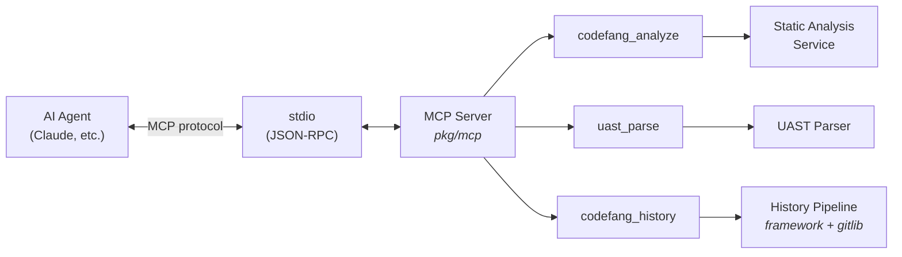

# MCP Server

Codefang includes a built-in [Model Context Protocol](https://modelcontextprotocol.io/)
(MCP) server that exposes its analysis capabilities as tools that AI agents
can discover and invoke programmatically.

---

## What is MCP?

The **Model Context Protocol** is an open standard for connecting AI assistants
to external tools and data sources. It defines a JSON-RPC protocol over
stdio transport that allows AI agents to:

1. **Discover** available tools and their schemas.
2. **Invoke** tools with structured parameters.
3. **Receive** structured results.

Codefang's MCP server turns code analysis into a first-class tool that any
MCP-compatible agent can use without manual setup.

---

## Quick Start

Start the MCP server:

```bash
codefang mcp
```

The server communicates over **stdio** (stdin/stdout) using JSON-RPC, which is
the standard MCP transport for local tool use. Agents connect by launching
the process and reading/writing to its stdio streams.

### Debug Mode

Enable debug logging to stderr for troubleshooting:

```bash
codefang mcp --debug
```

Debug mode enables:

- `slog.LevelDebug` logging with JSON format on stderr
- 100% trace sampling (all spans exported)

---

## Available Tools

The MCP server exposes three tools:

| Tool | Description |
|------|-------------|
| `codefang_analyze` | Run static analysis on inline source code |
| `uast_parse` | Parse source code into Universal AST |
| `codefang_history` | Run history analysis on a Git repository |

---

## Tool Reference

### `codefang_analyze`

Run static analyzers on inline source code. Returns per-function and aggregate
metrics.

#### Parameters

| Parameter | Type | Required | Default | Description |
|-----------|------|----------|---------|-------------|
| `code` | string | **Yes** | -- | Source code to analyze (max 1 MB) |
| `language` | string | **Yes** | -- | Programming language (e.g., `go`, `python`, `javascript`) |
| `analyzers` | string[] | No | all | List of analyzer names to run |

#### Available Analyzers

| Analyzer | Description |
|----------|-------------|
| `complexity` | Cyclomatic complexity per function |
| `comments` | Comment density and documentation coverage |
| `halstead` | Halstead software science metrics |
| `cohesion` | Class/module cohesion metrics |
| `imports` | Import graph and dependency analysis |

#### Example

```json
{
  "name": "codefang_analyze",
  "arguments": {
    "code": "package main\n\nfunc fibonacci(n int) int {\n\tif n <= 1 {\n\t\treturn n\n\t}\n\treturn fibonacci(n-1) + fibonacci(n-2)\n}\n",
    "language": "go",
    "analyzers": ["complexity"]
  }
}
```

---

### `uast_parse`

Parse source code into a Universal Abstract Syntax Tree. Optionally filter by
node type.

#### Parameters

| Parameter | Type | Required | Default | Description |
|-----------|------|----------|---------|-------------|
| `code` | string | **Yes** | -- | Source code to parse (max 1 MB) |
| `language` | string | **Yes** | -- | Programming language (e.g., `go`, `python`, `javascript`) |
| `query` | string | No | -- | Optional node type filter (e.g., `function_declaration`) |

#### Example

```json
{
  "name": "uast_parse",
  "arguments": {
    "code": "def hello():\n    print('world')\n",
    "language": "python",
    "query": "function_declaration"
  }
}
```

---

### `codefang_history`

Run history analysis on a local Git repository. Processes commit history and
returns analyzer-specific results.

#### Parameters

| Parameter | Type | Required | Default | Description |
|-----------|------|----------|---------|-------------|
| `repo_path` | string | **Yes** | -- | Absolute path to a Git repository |
| `analyzers` | string[] | No | all | List of history analyzer names |
| `limit` | integer | No | 1000 | Maximum number of commits to analyze |
| `since` | string | No | -- | Only analyze commits after this time (e.g., `24h`, `2024-01-01`, RFC3339) |
| `first_parent` | boolean | No | `false` | Follow only the first parent of merge commits |

#### Available Analyzers

| Analyzer | Description |
|----------|-------------|
| `burndown` | Code age and survival analysis |
| `couples` | File co-change coupling detection |
| `devs` | Developer contribution statistics |
| `file-history` | Per-file change timeline |
| `imports` | Import evolution over time |
| `sentiment` | Code comment sentiment over time |
| `shotness` | Function-level change frequency |
| `typos` | Identifier typo detection in diffs |

#### Example

```json
{
  "name": "codefang_history",
  "arguments": {
    "repo_path": "/home/user/projects/myapp",
    "analyzers": ["burndown", "devs"],
    "limit": 500,
    "since": "2024-01-01"
  }
}
```

---

## Agent Configuration

### Claude Code

Add Codefang as an MCP server in your Claude Code settings:

=== "User settings (~/.claude/settings.json)"

    ```json
    {
      "mcpServers": {
        "codefang": {
          "command": "codefang",
          "args": ["mcp"],
          "env": {}
        }
      }
    }
    ```

=== "Project settings (.claude/settings.json)"

    ```json
    {
      "mcpServers": {
        "codefang": {
          "command": "codefang",
          "args": ["mcp"],
          "env": {}
        }
      }
    }
    ```

=== "With debug mode"

    ```json
    {
      "mcpServers": {
        "codefang": {
          "command": "codefang",
          "args": ["mcp", "--debug"],
          "env": {}
        }
      }
    }
    ```

=== "With observability"

    ```json
    {
      "mcpServers": {
        "codefang": {
          "command": "codefang",
          "args": ["mcp"],
          "env": {
            "OTEL_EXPORTER_OTLP_ENDPOINT": "localhost:4317"
          }
        }
      }
    }
    ```

### Generic MCP Client

Any MCP-compatible client can connect by launching the process:

```bash
# The client spawns this process and communicates over stdio
codefang mcp
```

The server advertises its tools via the standard MCP `tools/list` method.
Clients call `tools/call` with the tool name and arguments.

---

## Error Handling

The MCP server returns structured errors for common failure modes:

| Error | Cause | Resolution |
|-------|-------|------------|
| `code parameter is required and must not be empty` | Missing `code` in analyze/parse | Provide source code |
| `language parameter is required and must not be empty` | Missing `language` | Specify the programming language |
| `code input exceeds maximum size` | Code > 1 MB | Reduce input size or analyze files on disk |
| `repo_path must be an absolute path` | Relative path provided | Use an absolute path |
| `repository path does not exist` | Invalid path | Verify the path exists |
| `path is not a git repository` | No `.git` directory | Ensure the path is a Git repo |
| `unsupported language` | Parser not available | Check supported languages |

Errors are returned in the MCP response with `isError: true` and a human-readable
error message in the `content` field.

---

## Observability

The MCP server supports full OpenTelemetry instrumentation:

### Tracing

Each tool invocation creates a root span with `SpanKindServer`:

| Span | Attributes |
|------|------------|
| `mcp.codefang_analyze` | `mcp.tool`, analyzer list |
| `mcp.uast_parse` | `mcp.tool`, language |
| `mcp.codefang_history` | `mcp.tool`, repo path, commit limit |

When a span is sampled, the `trace_id` is included in the response content
for correlation with backend traces.

### Metrics

RED metrics are recorded for each tool invocation:

| Metric | Description |
|--------|-------------|
| `codefang.requests.total` | Request count by tool and status |
| `codefang.request.duration.seconds` | Request duration histogram |
| `codefang.errors.total` | Error count by tool |
| `codefang.inflight.requests` | In-flight request gauge |

### Configuration

Set the OTLP endpoint to enable telemetry export:

```json
{
  "mcpServers": {
    "codefang": {
      "command": "codefang",
      "args": ["mcp"],
      "env": {
        "OTEL_EXPORTER_OTLP_ENDPOINT": "localhost:4317",
        "OTEL_EXPORTER_OTLP_INSECURE": "true"
      }
    }
  }
}
```

Without an OTLP endpoint, the server uses no-op providers with zero overhead.

---

## Architecture



The MCP server reuses the same analysis infrastructure as the CLI -- the same
analyzers, parsers, and pipeline components. The only difference is the
transport layer (stdio JSON-RPC instead of command-line flags and stdout).
