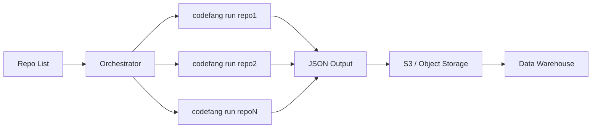

# Large-Scale Repository Scanning

This guide covers using Codefang to periodically scan large heterogeneous
codebases — thousands of repositories — and feed results into a data warehouse
for analytics.

## Overview

Codefang operates on one repository at a time. Scanning many repositories
requires external orchestration that invokes `codefang run` per repo and
collects the JSON output.



The streaming pipeline, checkpointing, and bounded-memory execution make each
individual run safe on large repositories without manual tuning.

## Bare Repository Support

Codefang uses libgit2 which opens both normal and bare repositories
transparently. No cloning is required.

```bash
# Point directly at a bare repo
codefang run /data/backups/repositories/@hashed/ab/cd/abcdef.git \
  -a history/* --format json --silent
```

This is relevant for:

- **GitLab backups** — contain bare repos under `repositories/@hashed/`
- **Gitolite mirrors** — bare repos by convention
- **`git clone --bare`** mirrors

### GitLab Backup Layout

GitLab backup tarballs contain bare repositories at predictable paths:

```
backup.tar
├── repositories/
│   └── @hashed/
│       ├── ab/cd/<sha256>.git        # bare repo
│       ├── ab/cd/<sha256>.wiki.git   # wiki (skip)
│       └── ...
└── db/
    └── database.sql.gz               # project name mapping
```

Extract and scan:

```bash
tar xf backup.tar -C /data/extract repositories/

find /data/extract/repositories -name "*.git" \
  ! -name "*.wiki.git" \
  ! -name "*.design.git" \
  -type d > /tmp/repo_paths.txt
```

## Output Format for DWH Ingestion

Use `--format json` for structured output suitable for data warehouse loading:

```bash
codefang run /path/to/repo -a history/* --format json --silent
```

!!! tip "Clean output"
    The `--silent` flag suppresses progress output on stderr, keeping stdout
    clean for piping.

### Adding Metadata

Wrap the output with repository metadata using `jq` before uploading:

```bash
codefang run "$REPO_PATH" -a history/* --format json --silent \
  | jq --arg repo "$REPO_NAME" --arg date "$(date -u +%Y-%m-%d)" \
       '{repo: $repo, scan_date: $date, results: .}'
```

### TimeSeries Format

For time-series analytics, use `--format timeseries` to merge all analyzer
outputs into a single chronologically-ordered JSON array:

```bash
codefang run /path/to/repo -a history/devs,history/burndown \
  --format timeseries --silent
```

## Orchestration

### GNU Parallel (Simple)

For a flat list of repository paths:

```bash
REPOS="/tmp/repo_paths.txt"
S3_BUCKET="s3://analytics/codefang"
DATE=$(date +%Y-%m-%d)

cat "$REPOS" | parallel -j 8 --joblog /tmp/codefang-jobs.log '
  REPO_NAME=$(basename {} .git)
  codefang run {} \
    -a history/* \
    --format json \
    --memory-budget 4GiB \
    --workers 4 \
    --silent \
    2>/tmp/codefang-logs/${REPO_NAME}.log \
  | aws s3 cp - '"${S3_BUCKET}/${DATE}"'/${REPO_NAME}.json
'
```

This produces `s3://analytics/codefang/2025-01-15/repo-name.json`, partitioned
by date.

### Kubernetes Jobs

For large fleets (thousands of repos), use Kubernetes Jobs or Argo Workflows:

```yaml
apiVersion: batch/v1
kind: Job
metadata:
  name: codefang-scan-myrepo
spec:
  backoffLimit: 2
  template:
    spec:
      containers:
        - name: codefang
          image: codefang:latest
          command:
            - sh
            - -c
            - |
              codefang run /workspace \
                -a history/* \
                --format json \
                --memory-budget 4GiB \
                --workers 4 \
                --checkpoint \
                --silent \
              | aws s3 cp - s3://bucket/results.json
          volumeMounts:
            - name: repo
              mountPath: /workspace
              readOnly: true
            - name: checkpoint
              mountPath: /tmp/codefang-checkpoints
          resources:
            requests:
              cpu: "4"
              memory: 6Gi
            limits:
              memory: 8Gi
      volumes:
        - name: repo
          persistentVolumeClaim:
            claimName: repo-myrepo
        - name: checkpoint
          emptyDir: {}
      restartPolicy: OnFailure
```

!!! info "Key considerations"
    - **Resource requests**: 4 CPU / 6 Gi memory per pod handles most repositories
    - **Checkpoint volume**: use `emptyDir` for ephemeral or a PVC for crash-recovery
    - **Parallelism**: 50-100 concurrent pods is typical for 60k repositories
    - **Scheduling**: use a CronJob or Argo CronWorkflow for periodic scans

## Memory Budget and Streaming

The `--memory-budget` flag controls how Codefang splits a repository's commit
history into chunks. See [Streaming Pipeline](../architecture/streaming-pipeline.md)
for details.

| Repository Size | Memory Budget | Expected Behavior |
|-----------------|---------------|-------------------|
| < 1k commits | 2 GiB | Single chunk, no hibernation |
| 1k-10k commits | 4 GiB | 2-10 chunks |
| 10k-100k commits | 4-8 GiB | 10-100 chunks with checkpoints |
| 100k+ commits | 8 GiB | Many chunks, checkpointing essential |

When unset, the budget defaults to 75% of system memory (capped at 4 GiB).

## Incremental Scanning with `--since`

For periodic scans, use `--since` to analyze only new commits since the last
run:

```bash
# Only commits from the last 7 days
codefang run /path/to/repo -a history/* --format json --since 168h

# Only commits after a specific date
codefang run /path/to/repo -a history/* --format json --since 2025-01-01

# RFC3339 timestamp
codefang run /path/to/repo -a history/* --format json --since 2025-01-01T00:00:00Z
```

| Format | Example | Meaning |
|--------|---------|---------|
| Go duration | `168h` | 7 days before now |
| Date only | `2025-01-01` | Midnight UTC on that date |
| RFC3339 | `2025-01-01T00:00:00Z` | Exact timestamp |

## Checkpointing and Crash Recovery

Checkpointing is enabled by default. After each fully processed chunk, the
pipeline saves analyzer state to disk. If a run is interrupted (OOM kill, pod
eviction, timeout), the next invocation with `--resume` automatically restarts
from the last completed chunk.

```bash
codefang run /path/to/repo \
  -a history/* \
  --format json \
  --checkpoint \
  --resume \
  --checkpoint-dir /tmp/codefang-checkpoints
```

!!! tip "Kubernetes"
    Mount the checkpoint directory on a PVC to survive pod restarts.

## DWH Loading

### Amazon Athena

Upload JSON to S3 with date partitioning, then create an external table:

```sql
CREATE EXTERNAL TABLE codefang_results (
  repo STRING,
  scan_date STRING,
  results STRING
)
PARTITIONED BY (dt STRING)
ROW FORMAT SERDE 'org.openx.data.jsonserde.JsonSerDe'
LOCATION 's3://analytics/codefang/'
TBLPROPERTIES ('has_encrypted_data'='false');

MSCK REPAIR TABLE codefang_results;
```

### Snowflake

```sql
CREATE STAGE codefang_stage URL='s3://analytics/codefang/'
  CREDENTIALS=(AWS_KEY_ID='...' AWS_SECRET_KEY='...');

COPY INTO codefang_raw FROM @codefang_stage
  FILE_FORMAT=(TYPE=JSON);

-- Flatten nested analyzer results
SELECT
  raw:repo::STRING AS repo,
  raw:scan_date::DATE AS scan_date,
  f.value:author::STRING AS author,
  f.value:commits::INT AS commits
FROM codefang_raw,
  LATERAL FLATTEN(input => raw:results:devs:authors) f;
```

### Spark / AWS Glue

```python
df = spark.read.json("s3://analytics/codefang/2025-01-15/")
devs_df = df.select("repo", explode("results.devs.authors").alias("author"))
devs_df.write.partitionBy("scan_date").parquet("s3://warehouse/codefang/devs/")
```

## Observability

Codefang includes OpenTelemetry support for monitoring scan fleet health.
See [Observability](observability.md) for full details.

```bash
export OTEL_EXPORTER_OTLP_ENDPOINT=http://otel-collector:4317
codefang run /path/to/repo -a history/* --format json --silent
```

| Metric | Use |
|--------|-----|
| `codefang.request.duration.seconds` | Identify slow repositories |
| `codefang.errors.total` | Track failure rate across the fleet |
| `codefang.cache.hits` / `codefang.cache.misses` | Tune cache sizes |

## Sizing Estimates

| Parameter | Typical Value |
|-----------|---------------|
| Per-repo runtime (4 cores, 4 GiB) | 1-10 min |
| JSON output per repo | 100 KB - 50 MB |
| 60k repos at 100 concurrent pods | 10-100 hours per full scan |
| Total S3 per full scan | 10-100 GB |
| Incremental scan (7 days) | 5-20x faster than full |

The primary bottleneck is I/O (reading Git objects). Bare repos on local SSD
or NVMe-backed EBS deliver the best throughput.
